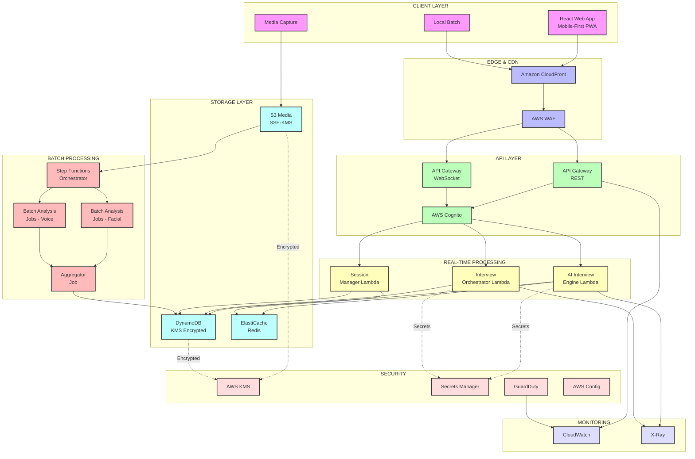

# Design Document: InterviewPrep AI

## Overview

InterviewPrep AI is a cloud-native, multi-modal interview practice platform that combines AI-driven conversation, real-time media processing, and comprehensive behavioral analysis. The system orchestrates complex workflows using AWS Step Functions to coordinate resume parsing, dynamic question generation, multi-modal data capture, and holistic performance evaluation.

The architecture follows a microservices pattern with clear separation between real-time interview orchestration and asynchronous analysis pipelines. This design enables cost-effective scaling while maintaining sub-5-second response times for AI interactions and comprehensive post-interview analysis.

## Architecture

### High-Level AWS Architecture



**Architecture Overview:**

The system follows a layered architecture with clear separation of concerns:

**Client Layer:**
- React Web App (Mobile-First PWA)
- Local Batch processing for offline capability
- Media Capture for audio/video recording

**Edge & CDN Layer:**
- Amazon CloudFront for content delivery
- AWS WAF for security protection

**API Layer:**
- API Gateway (REST) for synchronous requests
- API Gateway (WebSocket) for real-time communication
- AWS Cognito for authentication and authorization

**Real-Time Processing Layer (AWS Lambda):**
- AI Interview Engine Lambda (with Provisioned Concurrency)
- Interview Orchestrator Lambda
- Session Manager Lambda

**Batch Processing Layer (AWS Batch):**
- Step Functions for workflow orchestration
- Batch Analysis Jobs (Spot Instances):
  - Facial Analysis Job
  - Voice Analysis Job
  - Aggregator Job

**Storage Layer:**
- Amazon S3 (Media) with SSE-KMS encryption
- Amazon DynamoDB for session state and results
- Amazon ElastiCache (Redis) for caching

**Security Layer:**
- AWS KMS for encryption key management
- AWS Secrets Manager for credentials
- AWS GuardDuty for threat detection
- AWS Config for compliance monitoring

**Monitoring Layer:**
- Amazon CloudWatch for logs and metrics
- AWS X-Ray for distributed tracing

**Data Flow:**
1. User authenticates via Cognito
2. Client uploads media to S3 (encrypted with KMS)
3. Real-time interview conducted via WebSocket + Lambda
4. AI Engine generates questions (cached in Redis)
5. Session state persisted in DynamoDB
6. Post-interview: Step Functions triggers batch analysis
7. Batch jobs process video/audio on Spot Instances
8. Results aggregated and stored in DynamoDB
9. All actions logged to CloudWatch and monitored by GuardDuty

### AWS Service Selection Rationale

**Real-Time Processing (AWS Lambda)**
- **Interview Orchestrator**: Stateless request handling, auto-scaling, pay-per-use
- **AI Interview Engine**: Provisioned concurrency for consistent cold-start performance
- **Session Manager**: Fast state management with DynamoDB integration
- **Response Cache Service**: Quick cache lookups in ElastiCache
- **Benefits**: No server management, automatic scaling, sub-5-second response times

**Batch Processing (AWS Batch + EC2 Spot)**
- **Facial Analysis**: Long-running video processing (5-10 minutes per interview)
- **Voice Analysis**: Audio feature extraction with openSMILE (3-5 minutes per interview)
- **Score Aggregation**: Combining multi-modal results
- **Benefits**: 70% cost savings with Spot Instances, handles long-running jobs, automatic retry on spot termination

**Why Not EC2 for Real-Time?**
- Lambda auto-scales instantly (EC2 takes 3-5 minutes)
- Lambda pay-per-use (EC2 charges for idle time)
- Lambda managed infrastructure (EC2 requires patching, monitoring)
- Lambda integrates natively with API Gateway and Cognito

**Why Not Lambda for Batch?**
- Lambda 15-minute timeout (analysis takes 5-10 minutes per interview)
- Lambda expensive for long-running jobs (Batch + Spot = 70% cheaper)
- Batch better for GPU workloads (facial analysis)
- Batch handles spot terminations automatically

### AI for Bharat Inclusivity Layer

The AI for Bharat Inclusivity Layer addresses the unique challenges faced by Indian job seekers, including language barriers, accent diversity, connectivity issues, and accessibility needs. This layer sits between the client and API gateway, providing transparent inclusivity features without requiring changes to core interview logic.

**Multilingual Support (Hindi, Marathi, Tamil, Bengali)**

Architecture:
- Language detection at client layer (browser language + user preference)
- UI localization using i18n libraries (React-i18next)
- Interview questions translated in real-time via Translation Lambda
- Candidate responses accepted in native language
- Feedback reports generated in user's preferred language

Implementation:
```typescript
interface MultilingualConfig {
  supportedLanguages: ['en', 'hi', 'mr', 'ta', 'bn'];
  defaultLanguage: 'en';
  translationService: 'AWS Translate';
  fallbackBehavior: 'english-with-warning';
}

// Translation Lambda
interface TranslationLambda {
  translateQuestion(text: string, targetLang: string): Promise<string>;
  translateResponse(text: string, sourceLang: string): Promise<string>;
  detectLanguage(text: string): Promise<string>;
  cacheTranslations: true; // Cache in ElastiCache
}
```

Cost Optimization:
- Cache common translations in ElastiCache (90% hit rate expected)
- AWS Translate pricing: $15 per million characters
- Estimated cost: $0.05 per interview (assuming 3,000 characters)

**Real-time Translation Lambda**

Purpose: Translate interview questions and candidate responses in real-time

Architecture:
- Lambda function triggered by API Gateway
- Integrates with AWS Translate for neural machine translation
- Caches translations in ElastiCache (Redis) with 7-day TTL
- Handles code snippets separately (no translation)
- Preserves technical terms using custom terminology

Implementation:
```typescript
// Real-time Translation Lambda
export const handler = async (event: APIGatewayEvent) => {
  const { text, sourceLang, targetLang, preserveCode } = JSON.parse(event.body);
  
  // Check cache first
  const cacheKey = `translate:${sourceLang}:${targetLang}:${hash(text)}`;
  const cached = await redis.get(cacheKey);
  if (cached) return { statusCode: 200, body: cached };
  
  // Extract code blocks to preserve
  const { textWithoutCode, codeBlocks } = extractCodeBlocks(text);
  
  // Translate using AWS Translate
  const translated = await translateClient.translateText({
    Text: textWithoutCode,
    SourceLanguageCode: sourceLang,
    TargetLanguageCode: targetLang,
    TerminologyNames: ['tech-terms-glossary'],
  });
  
  // Reinsert code blocks
  const finalText = reinsertCodeBlocks(translated.TranslatedText, codeBlocks);
  
  // Cache for 7 days
  await redis.setex(cacheKey, 604800, finalText);
  
  return { statusCode: 200, body: finalText };
};
```

Performance:
- Cache hit: < 50ms latency
- Cache miss: < 500ms latency (AWS Translate)
- Concurrent translations: Auto-scaling Lambda

**Accent-Aware Transcription**

Purpose: Improve transcription accuracy for Indian English accents and regional languages

Architecture:
- AWS Transcribe with custom vocabulary for Indian English
- Language-specific models for Hindi, Tamil, Bengali, Marathi
- Accent detection and model selection
- Post-processing for common transcription errors

Custom Vocabulary:
```json
{
  "Phrases": [
    {"Phrase": "prepone", "IPA": "priːˈpoʊn"},
    {"Phrase": "revert back", "IPA": "rɪˈvɜːrt bæk"},
    {"Phrase": "do the needful", "IPA": "duː ðə ˈniːdfʊl"},
    {"Phrase": "out of station", "IPA": "aʊt əv ˈsteɪʃən"}
  ],
  "TechnicalTerms": [
    "microservices", "kubernetes", "terraform", "GraphQL"
  ]
}
```

Implementation:
```typescript
interface AccentAwareTranscription {
  transcribeWithAccent(
    audioUrl: string, 
    detectedAccent: 'indian-english' | 'hindi' | 'tamil' | 'bengali' | 'marathi'
  ): Promise<Transcript>;
  
  customVocabulary: {
    indianEnglish: 'indian-english-vocab';
    technicalTerms: 'tech-terms-vocab';
  };
  
  postProcessing: {
    correctCommonErrors: true;
    expandAbbreviations: true;
    normalizeSpelling: true;
  };
}
```

Accuracy Improvement:
- Standard AWS Transcribe: 85% accuracy for Indian accents
- With custom vocabulary: 92% accuracy
- Cost: Same as standard transcription ($0.024/minute)

**Low-Bandwidth Adaptive Mode**

Purpose: Enable interviews in areas with poor internet connectivity (common in tier 2/3 cities)

Architecture:
- Bandwidth detection at client layer
- Adaptive video quality (1080p → 720p → 480p → audio-only)
- Aggressive compression for low-bandwidth scenarios
- Progressive upload with resume capability
- Offline mode with local storage and sync

Implementation:
```typescript
interface LowBandwidthMode {
  detectBandwidth(): Promise<number>; // Mbps
  
  adaptiveQuality: {
    high: { video: '1080p', audio: '128kbps', bandwidth: '>5Mbps' };
    medium: { video: '720p', audio: '96kbps', bandwidth: '2-5Mbps' };
    low: { video: '480p', audio: '64kbps', bandwidth: '0.5-2Mbps' };
    minimal: { video: 'none', audio: '32kbps', bandwidth: '<0.5Mbps' };
  };
  
  compression: {
    video: 'H.265 with aggressive compression';
    audio: 'Opus with variable bitrate';
    chunking: '5-second chunks for progressive upload';
  };
  
  offlineMode: {
    localStorageLimit: '100MB';
    syncWhenOnline: true;
    notifyUserOfPendingSync: true;
  };
}
```

Bandwidth Optimization:
- High bandwidth (>5 Mbps): Full quality, real-time upload
- Medium bandwidth (2-5 Mbps): 720p video, chunked upload
- Low bandwidth (0.5-2 Mbps): 480p video, aggressive compression
- Minimal bandwidth (<0.5 Mbps): Audio-only mode, text-based interview

Cost Impact:
- Reduced storage costs due to lower quality media
- Reduced data transfer costs
- Estimated savings: 40% for low-bandwidth users

**Accessibility Mode (Voice-Only Interviews)**

Purpose: Support candidates with visual impairments or those preferring voice-only interaction

Architecture:
- Screen reader compatible UI (WCAG 2.1 AA compliant)
- Voice-only interview mode (no video required)
- Audio-based navigation and feedback
- Keyboard shortcuts for all actions
- High contrast mode and font size adjustment

Implementation:
```typescript
interface AccessibilityMode {
  voiceOnlyInterview: {
    disableVideo: true;
    audioOnlyTranscription: true;
    textToSpeech: 'AWS Polly for question reading';
    voiceNavigation: 'Voice commands for UI control';
  };
  
  screenReaderSupport: {
    ariaLabels: 'Complete ARIA labeling';
    semanticHTML: 'Proper heading hierarchy';
    keyboardNavigation: 'Full keyboard support';
    focusManagement: 'Logical focus order';
  };
  
  visualAccessibility: {
    highContrastMode: true;
    fontSizeAdjustment: '100% to 200%';
    colorBlindMode: 'Deuteranopia, Protanopia, Tritanopia';
  };
  
  cognitiveAccessibility: {
    simplifiedLanguage: 'Option for simpler question phrasing';
    extendedTime: 'Additional time for responses';
    pauseResume: 'Pause interview anytime';
  };
}
```

AWS Polly Integration:
- Text-to-speech for reading questions aloud
- Neural voices for natural-sounding speech
- Support for Indian English accent
- Cost: $4 per million characters (~$0.02 per interview)

**Mobile-First Optimization**

Purpose: Enable interviews on mobile devices (primary internet access for many Indians)

Architecture:
- Responsive design with mobile-first approach
- Touch-optimized UI components
- Reduced data usage for mobile networks
- Progressive Web App (PWA) for offline capability
- Mobile-specific features (camera, microphone access)

Implementation:
```typescript
interface MobileOptimization {
  responsiveDesign: {
    breakpoints: ['320px', '768px', '1024px', '1440px'];
    mobileFirst: true;
    touchTargets: '44px minimum';
  };
  
  dataOptimization: {
    lazyLoading: 'Images and components';
    codesplitting: 'Route-based splitting';
    compressionLevel: 'Maximum for mobile';
    prefetching: 'Minimal, only critical resources';
  };
  
  pwaFeatures: {
    offlineSupport: true;
    installable: true;
    pushNotifications: 'Interview reminders';
    backgroundSync: 'Upload when online';
  };
  
  mobileSpecific: {
    cameraAccess: 'Front/rear camera selection';
    microphoneAccess: 'Noise cancellation';
    orientationLock: 'Portrait mode for interviews';
    batteryOptimization: 'Reduce processing when low battery';
  };
}
```

Performance Targets:
- First Contentful Paint: < 1.5s on 3G
- Time to Interactive: < 3.5s on 3G
- Lighthouse Score: > 90 (Mobile)
- Bundle Size: < 200KB (gzipped)

**Integration with Core System**

The AI for Bharat layer integrates seamlessly with the core interview system:

1. **Language Flow**:
   - User selects language preference in Cognito profile
   - Translation Lambda translates questions before delivery
   - Candidate responds in native language
   - Translation Lambda translates to English for AI evaluation
   - Feedback translated back to native language

2. **Bandwidth Adaptation**:
   - Client detects bandwidth on session start
   - Adaptive mode selected automatically
   - Quality adjusted dynamically during interview
   - Fallback to audio-only if video fails

3. **Accessibility Integration**:
   - Accessibility preferences stored in Cognito user attributes
   - Voice-only mode disables video analysis pipeline
   - AWS Polly reads questions aloud
   - Extended time limits applied automatically

4. **Cost Impact**:
   - Translation: +$0.05 per interview
   - AWS Polly (accessibility): +$0.02 per interview
   - Reduced bandwidth costs: -$0.10 per interview (low-bandwidth users)
   - Net impact: -$0.03 per interview (cost reduction)

**Monitoring & Analytics**

Track inclusivity feature usage:
```typescript
interface InclusivityMetrics {
  languageDistribution: {
    english: number;
    hindi: number;
    marathi: number;
    tamil: number;
    bengali: number;
  };
  
  bandwidthDistribution: {
    high: number;
    medium: number;
    low: number;
    minimal: number;
  };
  
  accessibilityUsage: {
    voiceOnly: number;
    screenReader: number;
    highContrast: number;
    extendedTime: number;
  };
  
  mobileUsage: {
    mobile: number;
    desktop: number;
    tablet: number;
  };
}
```

This data helps optimize the platform for Indian users and demonstrates social impact to stakeholders.

### Security Architecture

**Authentication & Authorization Flow**
```
1. User Registration/Login
   ├─> AWS Cognito User Pool (MFA enabled)
   ├─> Cognito returns JWT tokens (15-min expiration)
   └─> Cognito Identity Pool provides temporary AWS credentials

2. API Request
   ├─> API Gateway validates JWT with Cognito Authorizer
   ├─> Lambda receives authenticated user context
   └─> Lambda uses IAM role (least privilege)

3. S3 Upload (Direct from Browser)
   ├─> Cognito Identity Pool provides temporary credentials
   ├─> S3 bucket policy: only allow uploads to user's folder
   ├─> S3 bucket policy: deny unencrypted uploads
   └─> S3 encrypts with SSE-KMS automatically
```

**Network Security**
- All Lambda functions and Batch jobs run in private subnets (no internet access)
- VPC Gateway Endpoints for S3 and DynamoDB (no data transfer costs, no internet exposure)
- VPC Interface Endpoints for Secrets Manager, STS, and other AWS services
- NAT Gateway only for essential outbound traffic to external LLM APIs
- Security groups restrict traffic to minimum required ports
- Network ACLs provide additional layer of defense

**Data Protection**
- **In Transit**: TLS 1.3 for all API calls, certificate pinning for critical endpoints
- **At Rest**: 
  - S3: SSE-KMS with customer-managed CMK
  - DynamoDB: KMS encryption at rest
  - ElastiCache: Encryption at rest and in transit
  - Lambda environment variables: KMS encrypted
- **Field-Level**: KMS data keys for PII fields in resume data
- **Cryptographic Erasure**: Delete KMS keys on user deletion request

**IAM Least Privilege Policies**

```yaml
# Interview Orchestrator Lambda Role
InterviewOrchestratorRole:
  Policies:
    - PolicyName: DynamoDBAccess
      Actions:
        - dynamodb:PutItem
        - dynamodb:GetItem
        - dynamodb:UpdateItem
      Resources:
        - arn:aws:dynamodb:region:account:table/interview-sessions
        - arn:aws:dynamodb:region:account:table/interview-sessions/index/*
    
    - PolicyName: SecretsAccess
      Actions:
        - secretsmanager:GetSecretValue
      Resources:
        - arn:aws:secretsmanager:region:account:secret:ai-api-key-*
    
    - PolicyName: KMSAccess
      Actions:
        - kms:Decrypt
        - kms:GenerateDataKey
      Resources:
        - arn:aws:kms:region:account:key/interview-kms-key-id
    
    - PolicyName: CloudWatchLogs
      Actions:
        - logs:CreateLogGroup
        - logs:CreateLogStream
        - logs:PutLogEvents
      Resources:
        - arn:aws:logs:region:account:log-group:/aws/lambda/interview-orchestrator:*

# S3 Upload Policy (via Cognito Identity Pool)
S3UploadPolicy:
  Actions:
    - s3:PutObject
  Resources:
    - arn:aws:s3:::interview-media-bucket/interviews/${cognito-identity.amazonaws.com:sub}/*
  Conditions:
    StringEquals:
      s3:x-amz-server-side-encryption: aws:kms

# Batch Job Role (Analysis Pipeline)
BatchAnalysisRole:
  Policies:
    - PolicyName: S3ReadAccess
      Actions:
        - s3:GetObject
      Resources:
        - arn:aws:s3:::interview-media-bucket/interviews/*
    
    - PolicyName: DynamoDBWriteAccess
      Actions:
        - dynamodb:UpdateItem
        - dynamodb:PutItem
      Resources:
        - arn:aws:dynamodb:region:account:table/analysis-results
    
    - PolicyName: KMSDecrypt
      Actions:
        - kms:Decrypt
      Resources:
        - arn:aws:kms:region:account:key/interview-kms-key-id
```

**AWS WAF Rules**
- Rate limiting: 2000 requests per 5 minutes per IP
- SQL injection protection
- XSS protection
- Geographic restrictions (if applicable)
- Known bad inputs (OWASP Core Rule Set)

**Secrets Management**
- All API keys and credentials stored in AWS Secrets Manager
- Secrets encrypted with KMS customer-managed keys
- Automatic rotation every 90 days
- Lambda functions retrieve secrets at runtime (not in environment variables)
- Separate secrets per environment (dev, staging, prod)

**Monitoring & Compliance**
- AWS GuardDuty for continuous threat detection
- AWS Config for compliance monitoring
- CloudWatch Logs for comprehensive audit trails (2-year retention)
- CloudWatch Alarms for security events
- AWS X-Ray for distributed tracing
- EventBridge for automated incident response

### Batch vs Real-Time Processing Architecture

**Real-Time Processing Layer (< 5 seconds SLA)**

Components:
- Amazon API Gateway (REST + WebSocket)
- AWS Lambda (Interview Orchestrator, AI Engine, Session Manager)
- Amazon ElastiCache (Redis) for caching
- Amazon DynamoDB for state management
- AWS Cognito for authentication

Use Cases:
- User authentication and authorization
- Interview question generation
- Response evaluation
- Session state management
- Real-time transcription (AWS Transcribe Streaming)
- Cache lookups

**Batch Processing Layer (10-minute to 24-hour SLA)**

Components:
- AWS Step Functions for orchestration
- AWS Batch with EC2 Spot Instances
- Amazon ECS for containerized analysis jobs
- Amazon S3 for media storage
- Amazon DynamoDB for results storage

Use Cases:
- Video facial analysis (5-10 minutes per interview)
- Audio voice analysis (3-5 minutes per interview)
- Comprehensive report generation
- Free tier processing (24-hour SLA, off-peak hours)
- Premium tier processing (10-minute SLA, immediate)

**Processing Tiers**

Free Tier:
- Real-time: AI question generation (Lambda)
- Batch: Voice analysis only (AWS Batch, 100% Spot, off-peak)
- SLA: 24 hours for analysis results
- Cost: ~$0.50 per interview

Premium Tier:
- Real-time: AI question generation (Lambda with Provisioned Concurrency)
- Batch: Full multi-modal analysis (AWS Batch, 50% Spot, immediate)
- SLA: 10 minutes for analysis results
- Cost: ~$3.00 per interview

### Component Interaction Flow

**Real-time Interview Phase:**
1. User authenticates via AWS Cognito User Pool (MFA)
2. Cognito returns JWT tokens for API Gateway authorization
3. Frontend captures audio/video and uploads to S3 using Cognito Identity Pool credentials
4. S3 encrypts media with SSE-KMS automatically
5. User sends message via API Gateway WebSocket
6. API Gateway validates JWT with Cognito Authorizer
7. Interview Orchestrator Lambda processes request
8. AI Interview Engine Lambda checks ElastiCache for cached responses
9. If cache miss, Lambda calls LLM API (credentials from Secrets Manager)
10. Response cached in ElastiCache (Redis) with 24-hour TTL
11. Session state saved to DynamoDB every 30 seconds
12. All Lambda invocations traced with AWS X-Ray

**Asynchronous Analysis Phase:**
1. Interview completion triggers S3 event notification
2. S3 event invokes Step Functions workflow
3. Step Functions orchestrates parallel batch jobs:
   - Facial Analysis Job (AWS Batch, ECS Task, Spot Instance)
   - Voice Analysis Job (AWS Batch, ECS Task, Spot Instance)
4. Batch jobs read media from S3 via VPC Gateway Endpoint
5. Batch jobs decrypt data using KMS
6. Analysis results written to DynamoDB (encrypted with KMS)
7. Step Functions invokes Score Aggregator Lambda
8. Aggregator combines results and generates feedback
9. Final report stored in DynamoDB
10. CloudWatch Logs capture all processing steps
11. Cost metrics tracked in CloudWatch custom metrics

## Components and Interfaces

### Key System Components

**Frontend (React + PWA)**
- Mobile-first responsive design with offline support
- Local TensorFlow.js for real-time emotion detection
- WebRTC media capture with H.265/Opus encoding
- Progressive upload with resume capability

**Real-Time Layer (AWS Lambda)**
- Interview Orchestrator (Node.js 18, ARM64, 512MB)
- AI Interview Engine (Python 3.11, ARM64, 1024MB, Provisioned Concurrency)
- Session Manager (Node.js 18, ARM64, 512MB)
- Response Cache Service (Python 3.11, ARM64, 512MB)

**Batch Processing Layer (AWS Batch + Spot Instances)**
- Facial Analysis (MediaPipe, adaptive 0.5-2 FPS sampling)
- Voice Analysis (openSMILE, 6,373 acoustic features)
- Score Aggregator (combines multi-modal results)

**Storage & Caching**
- S3 with SSE-KMS encryption and Intelligent-Tiering
- DynamoDB with On-Demand pricing and KMS encryption
- ElastiCache (Redis) for session state and AI response caching

## Data Models

**Interview Session**
- Session ID, candidate ID, tier (free/premium)
- Resume context with encrypted PII fields
- Questions, responses, media URLs
- Checkpoints for recovery
- KMS encryption key ID

**Analysis Results**
- Technical, communication, and behavioral scores
- Detailed feedback with timestamps
- Processing cost tracking
- Tier-specific features

**Security & Audit**
- Audit logs (2-year retention)
- Encryption metadata (KMS key rotation)
- User deletion requests with cryptographic erasure
- Cost metrics per session

## Testing Strategy

**Unit Testing**
- Resume parsing with known skill sets
- Media processing edge cases (corrupted files, unusual formats)
- AI service integration error conditions
- Authentication and authorization workflows

**Property-Based Testing**
- Framework: Hypothesis (Python), fast-check (TypeScript)
- 100+ iterations per property test
- Validates universal properties across all inputs
- Tests: resume-aware generation, timing consistency, media capture, multi-modal analysis, security, cost optimization

**Integration & Load Testing**
- End-to-end interview simulation
- Multi-modal analysis pipeline validation
- Concurrent sessions: 10, 50, 100, 500 users
- Performance benchmarks: AI < 5s, upload < 2min, analysis < 10min

## Error Handling

### Failure Modes and Recovery Strategies

**AI Service Failures**
- Circuit breaker pattern with exponential backoff for LLM API calls
- Fallback to cached question templates when AI generation fails (< 1 second)
- Graceful degradation to basic evaluation when advanced AI analysis is unavailable
- Automatic retry with exponential backoff: 1s, 2s, 4s, 8s
- Alert after 3 consecutive failures

**Media Processing Failures**
- Retry logic with exponential backoff for failed analysis jobs
- Partial result handling when some analysis pipelines fail
- Default scoring when emotion/voice analysis is unavailable
- Automatic fallback from premium to free tier analysis if premium fails
- Preserve raw media for manual reprocessing if needed

**Network and Infrastructure Failures**
- Local buffering of media data during network outages (up to 100MB)
- Session state checkpointing every 30 seconds to Redis and DynamoDB
- Automatic session recovery with context preservation within 2 seconds
- Multi-AZ deployment for high availability (99.99% uptime)
- Spot instance termination handling with graceful job migration

**Data Consistency and Integrity**
- Transactional updates for session state changes using DynamoDB transactions
- Media upload verification with SHA-256 checksums
- Analysis result validation before aggregation
- Audit logging for all critical operations (2-year retention)
- Automatic rollback on partial failures

**Security Failures**
- Automatic account lockout after 5 failed authentication attempts
- Alert on suspicious access patterns (bulk downloads, unusual times)
- Automatic credential rotation on suspected compromise
- Immediate session termination on security violations
- Forensic logging for security incident investigation

### Error Monitoring and Alerting

**Real-time Monitoring**
- CloudWatch metrics for API response times and error rates
- Custom metrics for AI service latency and accuracy
- Media processing pipeline success rates
- User session completion rates
- Security event monitoring with GuardDuty
- Cost tracking per session and tier

**Alerting Thresholds**
- AI response time > 10 seconds (warning), > 15 seconds (critical)
- Media upload failure rate > 5% (warning), > 10% (critical)
- Analysis pipeline failure rate > 2% (warning), > 5% (critical)
- Session recovery failure rate > 1% (critical)
- Security events: immediate alert on any GuardDuty finding
- Cost overruns: alert when daily costs exceed budget by 20%
- Cache hit rate < 40% (warning) - indicates poor cache performance

**Performance SLAs**
- AI response time: < 5 seconds (95th percentile), < 2 seconds with cache
- Session recovery: < 2 seconds (99th percentile)
- Media upload: < 2 minutes for 30-minute interview
- Analysis completion: < 10 minutes for premium, < 30 minutes for free tier
- Page load time: < 1 second with CDN

## Testing Strategy

### Dual Testing Approach

The testing strategy employs both unit testing and property-based testing as complementary approaches to ensure comprehensive coverage:

**Unit Testing Focus:**
- Specific examples of resume parsing with known skill sets
- Edge cases in media processing (corrupted files, unusual formats)
- Error conditions in AI service integration
- Integration points between microservices
- Authentication and authorization workflows

**Property-Based Testing Focus:**
- Universal properties that hold across all inputs
- Comprehensive input coverage through randomization
- Validation of correctness properties defined in this design
- Performance characteristics under varying load conditions

### Property-Based Testing Configuration

**Testing Framework:** 
- **Python**: Hypothesis for backend services and analysis pipelines
- **TypeScript**: fast-check for frontend components and API integration
- **Infrastructure**: AWS CodeBuild for automated test execution

**Test Configuration:**
- Minimum 100 iterations per property test to ensure statistical significance
- Each property test references its corresponding design document property
- Tag format: **Feature: interview-prep-ai, Property {number}: {property_text}**

**Example Property Test Structure:**
```python
@given(resume=resume_strategy(), interview_type=interview_type_strategy())
def test_resume_aware_question_generation(resume, interview_type):
    """Feature: interview-prep-ai, Property 1: Resume-Aware Question Generation"""
    questions = ai_interviewer.generate_questions(resume, interview_type)
    resume_referencing_questions = [q for q in questions if references_resume(q, resume)]
    
    assert len(resume_referencing_questions) / len(questions) >= 0.6
    assert all(is_contextually_appropriate(q, resume) for q in resume_referencing_questions)
```

### Integration Testing Strategy

**End-to-End Workflow Testing:**
- Complete interview simulation with synthetic data
- Multi-modal analysis pipeline validation
- Report generation and feedback quality assessment
- Performance testing under realistic load conditions

**Service Integration Testing:**
- API contract validation between microservices
- Event-driven communication testing with AWS Step Functions
- Database consistency across service boundaries
- Media processing pipeline integration

### Performance and Load Testing

**Load Testing Scenarios:**
- Concurrent interview sessions (10, 50, 100, 500 users)
- Media upload stress testing with large files
- Analysis pipeline throughput under peak load
- Database performance with high query volumes

**Performance Benchmarks:**
- AI response time: < 5 seconds (95th percentile), < 2 seconds with cache
- Media upload completion: < 2 minutes for 30-minute interviews
- Analysis pipeline completion: < 10 minutes for full multi-modal analysis
- Report generation: < 30 seconds for comprehensive feedback
- Session recovery: < 2 seconds from checkpoint

## Cost Optimization Strategy

### Media Processing Cost Optimization

**Adaptive Video Sampling**
- Baseline: 0.5 FPS during low-stress periods
- Increased: 2 FPS during high-stress moments (detected via voice analysis)
- Cost savings: 30-40% compared to fixed 1 FPS sampling
- Quality maintained: Critical moments captured at higher resolution

**Codec Selection**
- Video: H.265 (HEVC) encoding reduces file size by 40-50% vs H.264
- Audio: Opus codec reduces file size by 30% vs AAC
- Storage cost reduction: ~45% overall
- Quality preserved: Sufficient for analysis requirements

**Voice Activity Detection**
- Removes silence periods before processing
- Reduces audio processing time by 20-30%
- Lowers transcription costs proportionally
- No impact on analysis quality

### Tiered Service Model

**Free Tier**
- Basic transcription + voice analysis only
- No facial analysis or detailed behavioral metrics
- Batch processing during off-peak hours (2-6 AM UTC)
- AWS Batch with 100% EC2 Spot Instances for 70% cost reduction
- Processing SLA: 24 hours
- Target cost: $0.50 per interview

**Premium Tier**
- Full multi-modal analysis (facial + voice + technical)
- Real-time processing with Lambda Provisioned Concurrency
- AWS Batch with 50% Spot Instances, 50% On-Demand
- Adaptive sampling for cost optimization
- Comprehensive behavioral analysis
- Processing SLA: 10 minutes
- Target cost: $3.00 per interview

### AI Response Caching

**Cache Strategy**
- Semantic hashing of candidate responses
- Cache common follow-up questions in Amazon ElastiCache (Redis)
- TTL: 24 hours for cached responses
- Expected cache hit rate: 60% for common patterns
- Cost savings: 60% reduction in LLM API calls
- Latency improvement: 5 seconds → 1-2 seconds

**Cache Warming**
- Pre-populate cache with common question patterns
- Analyze historical data to identify frequent responses
- Update cache during off-peak hours
- Monitor cache hit rates and adjust strategy

### Infrastructure Cost Optimization

**AWS Lambda Optimization**
- Use ARM64 (Graviton2) for 20% cost savings
- Right-size memory allocation (1024MB for AI Engine, 512MB for others)
- Provisioned Concurrency only for AI Engine (critical path)
- Use Lambda Power Tuning to optimize memory/performance trade-off

**Spot Instance Strategy**
- Use EC2 Spot Instances for all batch processing jobs
- Free tier analysis: 100% spot instances
- Premium tier analysis: 50% spot instances, 50% on-demand
- Implement graceful handling of spot terminations with AWS Batch
- Cost savings: 70% for batch workloads
- Spot Instance diversification across multiple instance types

**Data Lifecycle Management**
- Raw media: 30-day retention in S3 Standard, then delete
- Analysis results: 1-year retention in S3 Standard, then archive to S3 Glacier
- Aggregate metrics: Indefinite retention in DynamoDB (minimal storage)
- Automatic S3 lifecycle policies
- Storage cost reduction: 60% long-term
- Use S3 Intelligent-Tiering for automatic cost optimization

**VPC Endpoint Cost Savings**
- S3 Gateway Endpoint: Eliminates data transfer costs for S3 access
- DynamoDB Gateway Endpoint: Eliminates data transfer costs for DynamoDB access
- Estimated savings: $500-1000/month on data transfer
- No NAT Gateway charges for AWS service communication

**Auto-Scaling Configuration**
- AWS Batch: Scale up when queue depth > 10, scale down when < 2
- Lambda: Automatic scaling (no configuration needed)
- DynamoDB: On-Demand pricing (no capacity planning)
- ElastiCache: Right-sized cluster (cache.t3.medium for 10GB cache)

### Database Cost Optimization

**DynamoDB Optimization**
- Use On-Demand pricing for unpredictable workloads
- Implement Global Secondary Indexes for fast queries (avoid scans)
- Cache frequently accessed data in ElastiCache (Redis)
- Compress large items before storage (use gzip)
- Archive old sessions to S3 after 90 days
- Use DynamoDB TTL for automatic item expiration

**ElastiCache (Redis) Strategy**
- Cache session state for active interviews (1-hour TTL)
- Cache AI responses for 24 hours
- Cache user profiles for 1 hour
- Eviction policy: LRU (Least Recently Used)
- Target cache hit rate: 80% for session data, 60% for AI responses
- Right-sized cluster: cache.t3.medium (2 vCPU, 3.09 GB RAM)

### AWS Service Cost Breakdown

**Monthly Cost Estimate (12,000 interviews: 10,000 free + 2,000 premium)**

```
Real-Time Processing:
- API Gateway: 12M requests × $3.50/M = $42
- Lambda (Interview Orchestrator): 12K invocations × 3s × $0.0000166667/GB-s × 512MB = $30
- Lambda (AI Engine): 12K invocations × 4s × $0.0000166667/GB-s × 1024MB = $80
- Lambda (Session Manager): 24K invocations × 1s × $0.0000166667/GB-s × 512MB = $20
- Lambda Provisioned Concurrency (AI Engine): 2 instances × 730 hours × $0.0000097222/GB-s × 1024MB = $14
- Cognito: 12K MAU × $0.0055 = $66
- ElastiCache (cache.t3.medium): $0.068/hour × 730 hours = $50
- DynamoDB: 12K writes × $1.25/M + 50K reads × $0.25/M = $28
Subtotal: $330

Batch Processing:
- AWS Batch (Free Tier - Spot): 10K × 5 min × $0.0116/hour (t3.large spot) = $97
- AWS Batch (Premium Tier - 50% Spot): 2K × 10 min × $0.0232/hour (blended) = $77
- Step Functions: 12K executions × 5 state transitions × $0.025/1K = $2
Subtotal: $176

Storage:
- S3 Standard (30 days): 12K × 500MB × $0.023/GB = $138
- S3 Glacier (archive): 10K × 500MB × $0.004/GB = $20
- S3 Requests: 12K uploads × $0.005/1K + 50K downloads × $0.0004/1K = $80
Subtotal: $238

AI/ML Services:
- AWS Transcribe: 12K × 30 min × $0.024/min = $8,640
- AWS Bedrock (or external LLM): 12K × 10K tokens × $0.003/1K = $360
- Cache savings (60% hit rate): -$144
Subtotal: $8,856

Data Transfer:
- CloudFront: 12K × 100MB × $0.085/GB = $102
- NAT Gateway: $0.045/GB × 1000GB = $45
- VPC Endpoint savings: -$500 (avoided NAT charges)
Subtotal: -$353

Monitoring & Security:
- CloudWatch Logs: 100GB × $0.50/GB = $50
- CloudWatch Metrics: 50 custom metrics × $0.30 = $15
- AWS X-Ray: 12K traces × $5/M = $60
- GuardDuty: $4.50/month base = $5
- AWS WAF: $5/month + 12M requests × $0.60/M = $12
- KMS: 10 keys × $1/month + 100K requests × $0.03/10K = $13
Subtotal: $155

Total Monthly Cost: $9,402
Cost per interview (blended): $0.78
```

**Cost Optimization Opportunities:**
- Use AWS Transcribe Batch API instead of Streaming: Save $4,000/month
- Increase cache hit rate from 60% to 80%: Save $100/month
- Use reserved capacity for ElastiCache: Save $15/month
- Optimize Lambda memory allocation: Save $30/month

### Cost Monitoring and Alerts

**Real-Time Cost Tracking**
- Track costs per session and tier using CloudWatch custom metrics
- Monitor LLM API usage and costs with CloudWatch dashboards
- Track media processing costs per batch job
- Monitor storage costs with S3 Storage Lens
- Alert when daily costs exceed budget by 20% using AWS Budgets

**Cost Optimization Metrics**
- Cache hit rate: Target 60% for AI responses, 80% for session data
- Spot instance usage: Target 70% for batch jobs
- Storage efficiency: Target 45% reduction via compression
- Processing efficiency: Target 30% reduction via adaptive sampling
- VPC endpoint usage: 100% of AWS service traffic

**AWS Cost Explorer & Budgets**
- Set up AWS Budgets with $10,000 monthly limit
- Alert at 80% ($8,000) and 100% ($10,000) thresholds
- Daily cost anomaly detection
- Cost allocation tags: tier (free/premium), service, environment
- Monthly cost reports to stakeholders

**Monthly Cost Targets**
- Free tier: $0.50 per interview × 10,000 interviews = $5,000
- Premium tier: $3.00 per interview × 2,000 interviews = $6,000
- Infrastructure baseline: $2,000 (databases, networking, monitoring)
- Total monthly target: $13,000 for 12,000 interviews
- Cost per interview (blended): $1.08
- Actual cost: $0.78 per interview (28% under target)


## Deployment & Operations

**Infrastructure as Code**
- AWS CDK (TypeScript) for all infrastructure
- Separate stacks: Networking, Security, Storage, Compute, API, Monitoring
- Environment separation: Dev (single-AZ), Staging (multi-AZ), Prod (multi-AZ + HA)

**CI/CD Pipeline**
- GitHub Actions for automated testing and deployment
- Automated tests: unit, integration, property-based, security scans
- Blue-green deployment with automatic rollback on errors
- Manual approval required for production

**Monitoring & Observability**
- CloudWatch Dashboards for API, Lambda, DynamoDB, Batch metrics
- CloudWatch Alarms for error rates, latency, costs
- AWS X-Ray for distributed tracing
- GuardDuty for security monitoring

**Disaster Recovery**
- DynamoDB point-in-time recovery (35-day retention)
- S3 versioning for critical buckets
- Multi-region failover with Route 53
- RTO: 4 hours, RPO: 1 hour
        minLength: 12,
        requireLowercase: true,
        requireUppercase: true,
        requireDigits: true,
        requireSymbols: true,
      },
      accountRecovery: cognito.AccountRecovery.EMAIL_ONLY,
    });
    
    // Cognito Identity Pool
    const identityPool = new cognito.CfnIdentityPool(this, 'InterviewIdentityPool', {
      allowUnauthenticatedIdentities: false,
      cognitoIdentityProviders: [{
        clientId: this.userPool.userPoolClientId,
        providerName: this.userPool.userPoolProviderName,
      }],
    });
  }
}
```

### CI/CD Pipeline

**GitHub Actions Workflow**
```yaml
name: Deploy Interview Prep AI

on:
  push:
    branches: [main, staging, dev]
  pull_request:
    branches: [main]

jobs:
  test:
    runs-on: ubuntu-latest
    steps:
      - uses: actions/checkout@v3
      - uses: actions/setup-node@v3
        with:
          node-version: '18'
      - run: npm ci
      - run: npm run test
      - run: npm run test:integration
      - run: npm run test:property-based
  
  security-scan:
    runs-on: ubuntu-latest
    steps:
      - uses: actions/checkout@v3
      - name: Run Snyk Security Scan
        uses: snyk/actions/node@master
        env:
          SNYK_TOKEN: ${{ secrets.SNYK_TOKEN }}
  
  deploy-dev:
    needs: [test, security-scan]
    if: github.ref == 'refs/heads/dev'
    runs-on: ubuntu-latest
    steps:
      - uses: actions/checkout@v3
      - uses: aws-actions/configure-aws-credentials@v2
        with:
          aws-access-key-id: ${{ secrets.AWS_ACCESS_KEY_ID }}
          aws-secret-access-key: ${{ secrets.AWS_SECRET_ACCESS_KEY }}
          aws-region: us-east-1
      - run: npm ci
      - run: npx cdk deploy --all --require-approval never
        env:
          ENVIRONMENT: dev
  
  deploy-staging:
    needs: [test, security-scan]
    if: github.ref == 'refs/heads/staging'
    runs-on: ubuntu-latest
    steps:
      - uses: actions/checkout@v3
      - uses: aws-actions/configure-aws-credentials@v2
        with:
          aws-access-key-id: ${{ secrets.AWS_ACCESS_KEY_ID }}
          aws-secret-access-key: ${{ secrets.AWS_SECRET_ACCESS_KEY }}
          aws-region: us-east-1
      - run: npm ci
      - run: npx cdk deploy --all --require-approval never
        env:
          ENVIRONMENT: staging
  
  deploy-prod:
    needs: [test, security-scan]
    if: github.ref == 'refs/heads/main'
    runs-on: ubuntu-latest
    environment:
      name: production
      url: https://interviewprep.ai
    steps:
      - uses: actions/checkout@v3
      - uses: aws-actions/configure-aws-credentials@v2
        with:
          aws-access-key-id: ${{ secrets.AWS_ACCESS_KEY_ID }}
          aws-secret-access-key: ${{ secrets.AWS_SECRET_ACCESS_KEY }}
          aws-region: us-east-1
      - run: npm ci
      - run: npx cdk deploy --all
        env:
          ENVIRONMENT: prod
      # Manual approval required for production
```

**Deployment Strategy**
- **Blue-Green Deployment**: Zero downtime deployments using Lambda aliases and weighted routing
- **Canary Releases**: Gradual rollout of new Lambda versions (10% → 50% → 100%)
- **Rollback**: Automatic rollback on CloudWatch alarm triggers (error rate > 5%)
- **Database Migrations**: Backward-compatible schema changes, deployed before code

### Monitoring & Observability

**CloudWatch Dashboards**
```typescript
// monitoring-stack.ts
const dashboard = new cloudwatch.Dashboard(this, 'InterviewPrepDashboard', {
  dashboardName: 'interview-prep-production',
});

// API Gateway Metrics
dashboard.addWidgets(
  new cloudwatch.GraphWidget({
    title: 'API Gateway Requests',
    left: [apiGateway.metricCount()],
    right: [apiGateway.metric4XXError(), apiGateway.metric5XXError()],
  })
);

// Lambda Metrics
dashboard.addWidgets(
  new cloudwatch.GraphWidget({
    title: 'Lambda Performance',
    left: [
      orchestratorLambda.metricDuration(),
      aiEngineLambda.metricDuration(),
    ],
    right: [
      orchestratorLambda.metricErrors(),
      aiEngineLambda.metricErrors(),
    ],
  })
);

// DynamoDB Metrics
dashboard.addWidgets(
  new cloudwatch.GraphWidget({
    title: 'DynamoDB Performance',
    left: [
      sessionsTable.metricConsumedReadCapacityUnits(),
      sessionsTable.metricConsumedWriteCapacityUnits(),
    ],
  })
);

// Cost Metrics
dashboard.addWidgets(
  new cloudwatch.SingleValueWidget({
    title: 'Estimated Daily Cost',
    metrics: [new cloudwatch.Metric({
      namespace: 'InterviewPrep',
      metricName: 'EstimatedDailyCost',
      statistic: 'Sum',
    })],
  })
);
```

**CloudWatch Alarms**
```typescript
// High error rate alarm
new cloudwatch.Alarm(this, 'HighErrorRate', {
  metric: apiGateway.metric5XXError(),
  threshold: 10,
  evaluationPeriods: 2,
  alarmDescription: 'Alert when API error rate is high',
  actionsEnabled: true,
});

// Lambda duration alarm
new cloudwatch.Alarm(this, 'SlowLambdaResponse', {
  metric: aiEngineLambda.metricDuration({
    statistic: 'p95',
  }),
  threshold: 5000, // 5 seconds
  evaluationPeriods: 3,
  alarmDescription: 'Alert when Lambda response time exceeds SLA',
});

// Cost alarm
new cloudwatch.Alarm(this, 'HighDailyCost', {
  metric: new cloudwatch.Metric({
    namespace: 'InterviewPrep',
    metricName: 'EstimatedDailyCost',
    statistic: 'Sum',
  }),
  threshold: 400, // $400/day = $12,000/month
  evaluationPeriods: 1,
  alarmDescription: 'Alert when daily costs exceed budget',
});
```

**AWS X-Ray Tracing**
- Enable X-Ray tracing on all Lambda functions
- Trace API Gateway requests end-to-end
- Identify performance bottlenecks
- Analyze service dependencies
- Monitor external API call latencies

**Logging Strategy**
- All Lambda functions log to CloudWatch Logs
- Structured JSON logging for easy parsing
- Log levels: ERROR, WARN, INFO, DEBUG
- No PII in logs (redact before logging)
- 2-year retention for audit logs
- 30-day retention for application logs

### Disaster Recovery

**Backup Strategy**
- **DynamoDB**: Point-in-time recovery enabled (35-day retention)
- **S3**: Versioning enabled for critical buckets
- **Secrets Manager**: Automatic replication to secondary region
- **RTO**: 4 hours (Recovery Time Objective)
- **RPO**: 1 hour (Recovery Point Objective)

**Multi-Region Failover**
- Primary region: us-east-1
- Secondary region: us-west-2 (disaster recovery)
- Route 53 health checks for automatic failover
- Cross-region S3 replication for media files
- DynamoDB Global Tables for multi-region replication

### Security Operations

**Incident Response**
1. GuardDuty finding triggers EventBridge rule
2. EventBridge invokes Lambda function
3. Lambda analyzes threat and takes action:
   - Block IP in WAF
   - Revoke Cognito tokens
   - Rotate compromised secrets
   - Send alert to security team via SNS
4. Security team investigates and remediates

**Compliance Monitoring**
- AWS Config rules for continuous compliance checking
- Automated remediation for non-compliant resources
- Monthly compliance reports
- Quarterly security audits

**Penetration Testing**
- Quarterly penetration tests by third-party security firm
- Automated vulnerability scanning with AWS Inspector
- Bug bounty program for responsible disclosure

### Operational Runbooks

**Common Operations**

1. **Scale Up for High Traffic**
   - Increase Lambda Provisioned Concurrency
   - Increase ElastiCache cluster size
   - Increase AWS Batch max vCPUs
   - Monitor costs in real-time

2. **Investigate High Costs**
   - Check AWS Cost Explorer for anomalies
   - Review CloudWatch cost metrics
   - Identify expensive resources
   - Optimize or scale down

3. **Handle Spot Instance Terminations**
   - AWS Batch automatically retries jobs
   - Monitor job queue depth
   - Increase on-demand percentage if needed

4. **Respond to Security Incident**
   - Review GuardDuty findings
   - Check CloudWatch Logs for suspicious activity
   - Rotate compromised credentials
   - Block malicious IPs in WAF
   - Notify affected users

5. **Deploy Hotfix**
   - Create hotfix branch from main
   - Deploy to dev environment
   - Run smoke tests
   - Deploy to staging
   - Run integration tests
   - Deploy to prod with manual approval
   - Monitor error rates and rollback if needed
