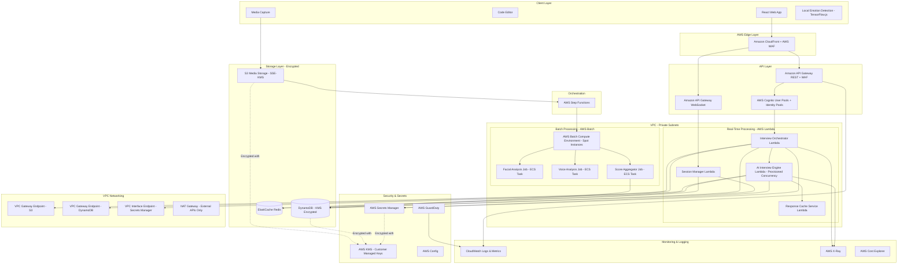

# Design Document: InterviewPrep AI

## Overview

InterviewPrep AI is a cloud-native, multi-modal interview practice platform that combines AI-driven conversation, real-time media processing, and comprehensive behavioral analysis. The system orchestrates complex workflows using AWS Step Functions to coordinate resume parsing, dynamic question generation, multi-modal data capture, and holistic performance evaluation.

The architecture follows a microservices pattern with clear separation between real-time interview orchestration and asynchronous analysis pipelines. This design enables cost-effective scaling while maintaining sub-5-second response times for AI interactions and comprehensive post-interview analysis.

## Architecture

### High-Level AWS Architecture



### AWS Service Selection Rationale

**Real-Time Processing (AWS Lambda)**
- **Interview Orchestrator**: Stateless request handling, auto-scaling, pay-per-use
- **AI Interview Engine**: Provisioned concurrency for consistent cold-start performance
- **Session Manager**: Fast state management with DynamoDB integration
- **Response Cache Service**: Quick cache lookups in ElastiCache
- **Benefits**: No server management, automatic scaling, sub-5-second response times

**Batch Processing (AWS Batch + EC2 Spot)**
- **Facial Analysis**: Long-running video processing (5-10 minutes per interview)
- **Voice Analysis**: Audio feature extraction with openSMILE (3-5 minutes per interview)
- **Score Aggregation**: Combining multi-modal results
- **Benefits**: 70% cost savings with Spot Instances, handles long-running jobs, automatic retry on spot termination

**Why Not EC2 for Real-Time?**
- Lambda auto-scales instantly (EC2 takes 3-5 minutes)
- Lambda pay-per-use (EC2 charges for idle time)
- Lambda managed infrastructure (EC2 requires patching, monitoring)
- Lambda integrates natively with API Gateway and Cognito

**Why Not Lambda for Batch?**
- Lambda 15-minute timeout (analysis takes 5-10 minutes per interview)
- Lambda expensive for long-running jobs (Batch + Spot = 70% cheaper)
- Batch better for GPU workloads (facial analysis)
- Batch handles spot terminations automatically

### Security Architecture

**Authentication & Authorization Flow**
```
1. User Registration/Login
   ├─> AWS Cognito User Pool (MFA enabled)
   ├─> Cognito returns JWT tokens (15-min expiration)
   └─> Cognito Identity Pool provides temporary AWS credentials

2. API Request
   ├─> API Gateway validates JWT with Cognito Authorizer
   ├─> Lambda receives authenticated user context
   └─> Lambda uses IAM role (least privilege)

3. S3 Upload (Direct from Browser)
   ├─> Cognito Identity Pool provides temporary credentials
   ├─> S3 bucket policy: only allow uploads to user's folder
   ├─> S3 bucket policy: deny unencrypted uploads
   └─> S3 encrypts with SSE-KMS automatically
```

**Network Security**
- All Lambda functions and Batch jobs run in private subnets (no internet access)
- VPC Gateway Endpoints for S3 and DynamoDB (no data transfer costs, no internet exposure)
- VPC Interface Endpoints for Secrets Manager, STS, and other AWS services
- NAT Gateway only for essential outbound traffic to external LLM APIs
- Security groups restrict traffic to minimum required ports
- Network ACLs provide additional layer of defense

**Data Protection**
- **In Transit**: TLS 1.3 for all API calls, certificate pinning for critical endpoints
- **At Rest**: 
  - S3: SSE-KMS with customer-managed CMK
  - DynamoDB: KMS encryption at rest
  - ElastiCache: Encryption at rest and in transit
  - Lambda environment variables: KMS encrypted
- **Field-Level**: KMS data keys for PII fields in resume data
- **Cryptographic Erasure**: Delete KMS keys on user deletion request

**IAM Least Privilege Policies**

```yaml
# Interview Orchestrator Lambda Role
InterviewOrchestratorRole:
  Policies:
    - PolicyName: DynamoDBAccess
      Actions:
        - dynamodb:PutItem
        - dynamodb:GetItem
        - dynamodb:UpdateItem
      Resources:
        - arn:aws:dynamodb:region:account:table/interview-sessions
        - arn:aws:dynamodb:region:account:table/interview-sessions/index/*
    
    - PolicyName: SecretsAccess
      Actions:
        - secretsmanager:GetSecretValue
      Resources:
        - arn:aws:secretsmanager:region:account:secret:ai-api-key-*
    
    - PolicyName: KMSAccess
      Actions:
        - kms:Decrypt
        - kms:GenerateDataKey
      Resources:
        - arn:aws:kms:region:account:key/interview-kms-key-id
    
    - PolicyName: CloudWatchLogs
      Actions:
        - logs:CreateLogGroup
        - logs:CreateLogStream
        - logs:PutLogEvents
      Resources:
        - arn:aws:logs:region:account:log-group:/aws/lambda/interview-orchestrator:*

# S3 Upload Policy (via Cognito Identity Pool)
S3UploadPolicy:
  Actions:
    - s3:PutObject
  Resources:
    - arn:aws:s3:::interview-media-bucket/interviews/${cognito-identity.amazonaws.com:sub}/*
  Conditions:
    StringEquals:
      s3:x-amz-server-side-encryption: aws:kms

# Batch Job Role (Analysis Pipeline)
BatchAnalysisRole:
  Policies:
    - PolicyName: S3ReadAccess
      Actions:
        - s3:GetObject
      Resources:
        - arn:aws:s3:::interview-media-bucket/interviews/*
    
    - PolicyName: DynamoDBWriteAccess
      Actions:
        - dynamodb:UpdateItem
        - dynamodb:PutItem
      Resources:
        - arn:aws:dynamodb:region:account:table/analysis-results
    
    - PolicyName: KMSDecrypt
      Actions:
        - kms:Decrypt
      Resources:
        - arn:aws:kms:region:account:key/interview-kms-key-id
```

**AWS WAF Rules**
- Rate limiting: 2000 requests per 5 minutes per IP
- SQL injection protection
- XSS protection
- Geographic restrictions (if applicable)
- Known bad inputs (OWASP Core Rule Set)

**Secrets Management**
- All API keys and credentials stored in AWS Secrets Manager
- Secrets encrypted with KMS customer-managed keys
- Automatic rotation every 90 days
- Lambda functions retrieve secrets at runtime (not in environment variables)
- Separate secrets per environment (dev, staging, prod)

**Monitoring & Compliance**
- AWS GuardDuty for continuous threat detection
- AWS Config for compliance monitoring
- CloudWatch Logs for comprehensive audit trails (2-year retention)
- CloudWatch Alarms for security events
- AWS X-Ray for distributed tracing
- EventBridge for automated incident response

### Batch vs Real-Time Processing Architecture

**Real-Time Processing Layer (< 5 seconds SLA)**

Components:
- Amazon API Gateway (REST + WebSocket)
- AWS Lambda (Interview Orchestrator, AI Engine, Session Manager)
- Amazon ElastiCache (Redis) for caching
- Amazon DynamoDB for state management
- AWS Cognito for authentication

Use Cases:
- User authentication and authorization
- Interview question generation
- Response evaluation
- Session state management
- Real-time transcription (AWS Transcribe Streaming)
- Cache lookups

**Batch Processing Layer (10-minute to 24-hour SLA)**

Components:
- AWS Step Functions for orchestration
- AWS Batch with EC2 Spot Instances
- Amazon ECS for containerized analysis jobs
- Amazon S3 for media storage
- Amazon DynamoDB for results storage

Use Cases:
- Video facial analysis (5-10 minutes per interview)
- Audio voice analysis (3-5 minutes per interview)
- Comprehensive report generation
- Free tier processing (24-hour SLA, off-peak hours)
- Premium tier processing (10-minute SLA, immediate)

**Processing Tiers**

Free Tier:
- Real-time: AI question generation (Lambda)
- Batch: Voice analysis only (AWS Batch, 100% Spot, off-peak)
- SLA: 24 hours for analysis results
- Cost: ~$0.50 per interview

Premium Tier:
- Real-time: AI question generation (Lambda with Provisioned Concurrency)
- Batch: Full multi-modal analysis (AWS Batch, 50% Spot, immediate)
- SLA: 10 minutes for analysis results
- Cost: ~$3.00 per interview

### Component Interaction Flow

**Real-time Interview Phase:**
1. User authenticates via AWS Cognito User Pool (MFA)
2. Cognito returns JWT tokens for API Gateway authorization
3. Frontend captures audio/video and uploads to S3 using Cognito Identity Pool credentials
4. S3 encrypts media with SSE-KMS automatically
5. User sends message via API Gateway WebSocket
6. API Gateway validates JWT with Cognito Authorizer
7. Interview Orchestrator Lambda processes request
8. AI Interview Engine Lambda checks ElastiCache for cached responses
9. If cache miss, Lambda calls LLM API (credentials from Secrets Manager)
10. Response cached in ElastiCache (Redis) with 24-hour TTL
11. Session state saved to DynamoDB every 30 seconds
12. All Lambda invocations traced with AWS X-Ray

**Asynchronous Analysis Phase:**
1. Interview completion triggers S3 event notification
2. S3 event invokes Step Functions workflow
3. Step Functions orchestrates parallel batch jobs:
   - Facial Analysis Job (AWS Batch, ECS Task, Spot Instance)
   - Voice Analysis Job (AWS Batch, ECS Task, Spot Instance)
4. Batch jobs read media from S3 via VPC Gateway Endpoint
5. Batch jobs decrypt data using KMS
6. Analysis results written to DynamoDB (encrypted with KMS)
7. Step Functions invokes Score Aggregator Lambda
8. Aggregator combines results and generates feedback
9. Final report stored in DynamoDB
10. CloudWatch Logs capture all processing steps
11. Cost metrics tracked in CloudWatch custom metrics

## Components and Interfaces

### Frontend Components

**React Web Application**
- **Interview Interface**: Real-time conversation UI with video preview
- **Code Editor**: Integrated coding environment with syntax highlighting
- **Media Capture Manager**: Handles WebRTC streams and local buffering
- **Session Recovery**: Automatic reconnection and state restoration
- **Local Emotion Detection**: TensorFlow.js-based facial analysis for real-time feedback
- **CDN-Optimized Assets**: CloudFront delivery for sub-second page loads

**Key Interfaces:**
```typescript
interface InterviewSession {
  sessionId: string;
  candidateId: string;
  resumeContext: ResumeContext;
  currentQuestion: Question;
  responses: Response[];
  mediaUrls: MediaUrls;
  status: SessionStatus;
  tier: 'free' | 'premium';
}

interface MediaCapture {
  startRecording(): Promise<void>;
  stopRecording(): Promise<MediaUrls>;
  uploadChunk(chunk: Blob): Promise<void>;
  getBufferedData(): Blob[];
  encodeWithH265(): Promise<Blob>;
  compressAudioWithOpus(): Promise<Blob>;
}

interface LocalEmotionDetector {
  detectEmotion(videoFrame: ImageData): EmotionResult;
  initializeTensorFlowJS(): Promise<void>;
  getRealtimeFeedback(): EmotionPoint[];
}
```

### Backend Core Services

**Interview Orchestrator (AWS Lambda)**
- Manages interview flow and state transitions
- Coordinates between AI engine and session persistence
- Handles resume context injection and question sequencing
- Implements circuit breaker patterns for AI service failures
- Manages tiered processing (free vs premium)
- **Runtime**: Node.js 18 on ARM64 (Graviton2)
- **Memory**: 512 MB
- **Timeout**: 30 seconds
- **Concurrency**: Reserved 10, Max 100
- **VPC**: Private subnet with VPC endpoints

**AI Interview Engine (AWS Lambda with Provisioned Concurrency)**
- Integrates with AWS Bedrock or external LLM APIs
- Generates resume-aware questions with company-specific styling
- Evaluates technical responses for correctness and clarity
- Maintains conversation context and generates dynamic follow-ups
- Implements intelligent response caching with ElastiCache
- Uses exponential backoff and circuit breaker for API failures
- **Runtime**: Python 3.11 on ARM64 (Graviton2)
- **Memory**: 1024 MB
- **Timeout**: 60 seconds
- **Provisioned Concurrency**: 2 instances (warm start)
- **VPC**: Private subnet with Secrets Manager endpoint

**Session Manager (AWS Lambda)**
- Provides resilient session state management
- Implements checkpoint-based recovery mechanisms
- Handles concurrent session scaling and resource allocation
- Manages session timeouts and graceful termination
- Uses DynamoDB Global Secondary Indexes for fast recovery queries
- Caches session state in ElastiCache for sub-second access
- **Runtime**: Node.js 18 on ARM64 (Graviton2)
- **Memory**: 512 MB
- **Timeout**: 15 seconds
- **VPC**: Private subnet with DynamoDB endpoint

**Response Cache Service (AWS Lambda)**
- Caches AI-generated responses based on answer similarity
- Uses semantic hashing to identify similar responses
- Reduces LLM API calls by 60% for common patterns
- Implements TTL-based cache invalidation (24 hours)
- Stores cached responses in ElastiCache with compression
- **Runtime**: Python 3.11 on ARM64 (Graviton2)
- **Memory**: 512 MB
- **Timeout**: 10 seconds
- **VPC**: Private subnet with ElastiCache access

**Key Interfaces:**
```typescript
interface AIInterviewEngine {
  generateQuestion(context: InterviewContext): Promise<Question>;
  evaluateResponse(response: Response): Promise<Evaluation>;
  generateFollowUp(evaluation: Evaluation): Promise<Question>;
  getCachedResponse(responseHash: string): Promise<Question | null>;
  cacheResponse(responseHash: string, question: Question): Promise<void>;
}

interface SessionManager {
  createSession(candidateId: string, tier: 'free' | 'premium'): Promise<SessionId>;
  saveCheckpoint(sessionId: string, state: SessionState): Promise<void>;
  recoverSession(sessionId: string): Promise<SessionState>;
  getCachedSession(sessionId: string): Promise<SessionState | null>;
}

interface ResponseCache {
  computeSemanticHash(response: string): string;
  getCachedQuestion(hash: string): Promise<Question | null>;
  cacheQuestion(hash: string, question: Question, ttl: number): Promise<void>;
}

// IAM Role for Interview Orchestrator Lambda
interface OrchestratorLambdaRole {
  policies: {
    dynamodb: ['PutItem', 'GetItem', 'UpdateItem'] on 'interview-sessions' table;
    secretsmanager: ['GetSecretValue'] on 'ai-api-key' secret;
    kms: ['Decrypt', 'GenerateDataKey'] on interview KMS key;
    logs: ['CreateLogGroup', 'CreateLogStream', 'PutLogEvents'];
    xray: ['PutTraceSegments', 'PutTelemetryRecords'];
  };
}

// IAM Role for AI Engine Lambda
interface AIEngineLambdaRole {
  policies: {
    secretsmanager: ['GetSecretValue'] on 'llm-api-key' secret;
    elasticache: ['Connect'] to Redis cluster;
    kms: ['Decrypt'] on interview KMS key;
    bedrock: ['InvokeModel'] on specified models;
    logs: ['CreateLogGroup', 'CreateLogStream', 'PutLogEvents'];
    xray: ['PutTraceSegments', 'PutTelemetryRecords'];
  };
}
```

### Analysis Pipeline Components

**Step Functions Orchestrator**
Based on AWS best practices for multi-stage AI workflows, the orchestrator coordinates parallel analysis tasks with proper error handling and retry logic. The workflow implements the following pattern:

```json
{
  "Comment": "Multi-modal interview analysis pipeline",
  "StartAt": "ParallelAnalysis",
  "States": {
    "ParallelAnalysis": {
      "Type": "Parallel",
      "Branches": [
        {
          "StartAt": "FacialAnalysis",
          "States": {
            "FacialAnalysis": {
              "Type": "Task",
              "Resource": "arn:aws:batch:region:account:job-queue/facial-analysis"
            }
          }
        },
        {
          "StartAt": "VoiceAnalysis", 
          "States": {
            "VoiceAnalysis": {
              "Type": "Task",
              "Resource": "arn:aws:batch:region:account:job-queue/voice-analysis"
            }
          }
        }
      ],
      "Next": "AggregateResults"
    }
  }
}
```

**Facial Analysis Pipeline**
Leverages MediaPipe's BlazeFace model for real-time face detection and landmark extraction. The pipeline uses adaptive sampling to optimize costs:

- **Adaptive Frame Sampling**: 
  - 0.5 FPS during low-stress periods (detected via voice analysis)
  - 2 FPS during high-stress moments (voice stress indicators present)
  - Reduces processing costs by 30-40% compared to fixed 1 FPS
- **Local Browser Processing**: TensorFlow.js runs basic emotion detection client-side for real-time feedback
- **Cloud Processing**: MediaPipe Face Landmarker identifies detailed facial landmarks
- **Emotion Classification**: Custom lightweight classifier trained on facial action units
- **Confidence Timeline**: Generates time-series data for stress and engagement levels
- **Privacy Protection**: Masks facial features in stored video after analysis completion

**Voice Analysis Pipeline**
Utilizes openSMILE for comprehensive acoustic feature extraction with real-time processing capabilities:

- **Voice Activity Detection**: Removes silence periods to reduce processing costs by 20-30%
- **Feature Extraction**: openSMILE generates 6,373 acoustic features per audio segment
- **Emotion Classification**: SVM classifier trained on prosodic and spectral features
- **Confidence Metrics**: Analyzes speech rate, hesitation patterns, and vocal stress indicators
- **Stress Detection**: Identifies high-stress moments to trigger adaptive video sampling

**Tiered Processing Strategy**
- **Free Tier**: 
  - Basic transcription + voice analysis only
  - Batch processing during off-peak hours (2-6 AM UTC)
  - Uses AWS Spot Instances (70% cost reduction)
  - No facial analysis or detailed behavioral metrics
- **Premium Tier**:
  - Full multi-modal analysis (facial + voice + technical)
  - Real-time processing with on-demand instances
  - Adaptive sampling for cost optimization
  - Comprehensive behavioral analysis

**Key Interfaces:**
```typescript
interface FacialAnalysisResult {
  emotionTimeline: EmotionPoint[];
  confidenceScore: number;
  stressIndicators: StressEvent[];
  engagementLevel: number;
  samplingRate: number; // Adaptive: 0.5-2 FPS
  localAnalysisUsed: boolean;
}

interface VoiceAnalysisResult {
  voiceConfidence: ConfidencePoint[];
  emotionalState: EmotionClassification[];
  speechMetrics: SpeechMetrics;
  stressMarkers: StressMarker[];
  highStressPeriods: TimeRange[]; // Triggers adaptive video sampling
}

interface TieredAnalysisConfig {
  tier: 'free' | 'premium';
  enableFacialAnalysis: boolean;
  enableVoiceAnalysis: boolean;
  processingPriority: 'realtime' | 'batch';
  useSpotInstances: boolean;
}
```

## Data Models

### Core Domain Models

**Interview Session Model**
```typescript
interface InterviewSession {
  sessionId: string;
  candidateId: string;
  createdAt: Date;
  updatedAt: Date;
  status: 'active' | 'paused' | 'completed' | 'failed';
  tier: 'free' | 'premium';
  resumeContext: ResumeContext;
  questions: Question[];
  responses: Response[];
  mediaUrls: MediaUrls;
  checkpoints: SessionCheckpoint[];
  encryptionKeyId: string; // For field-level encryption
}

interface ResumeContext {
  skills: Skill[];
  experience: Experience[];
  projects: Project[];
  education: Education[];
  parsedAt: Date;
  encryptedFields: string[]; // Fields with sensitive data
}
```

**Analysis Results Model**
```typescript
interface AnalysisResult {
  sessionId: string;
  technicalScore: TechnicalEvaluation;
  communicationScore: CommunicationEvaluation;
  behavioralScore: BehavioralEvaluation;
  overallScore: number;
  feedback: FeedbackReport;
  createdAt: Date;
  tier: 'free' | 'premium';
  processingCost: number; // Track costs per analysis
}

interface TechnicalEvaluation {
  correctness: number;
  codeQuality: number;
  problemSolving: number;
  explanationClarity: number;
  detailedFeedback: string[];
}

interface BehavioralEvaluation {
  confidenceLevel: number;
  stressManagement: number;
  engagement: number;
  emotionalStability: number;
  confidenceMismatchEvents: ConfidenceMismatch[];
  availableForTier: boolean; // Premium only
}
```

### Media Processing Models

**Media Timeline Model**
```typescript
interface MediaTimeline {
  sessionId: string;
  audioUrl: string; // Opus-encoded
  videoUrl: string; // H.265-encoded
  transcriptSegments: TranscriptSegment[];
  facialEmotions: EmotionPoint[];
  voiceMetrics: VoicePoint[];
  synchronizationOffset: number;
  compressionRatio: number;
  storageSize: number;
  retentionPolicy: DataRetentionPolicy;
}

interface EmotionPoint {
  timestamp: number;
  emotion: 'confident' | 'nervous' | 'engaged' | 'stressed';
  intensity: number;
  facialLandmarks?: FacialLandmark[];
  samplingRate: number; // 0.5 or 2 FPS
  detectedLocally: boolean; // TensorFlow.js vs cloud
}

interface DataRetentionPolicy {
  rawMediaRetentionDays: 30;
  analysisResultsRetentionDays: 365;
  aggregateMetricsRetentionDays: -1; // Indefinite
  scheduledDeletionDate?: Date;
}
```

### Security Models

**Audit Log Model**
```typescript
interface AuditLog {
  logId: string;
  timestamp: Date;
  userId: string;
  action: 'read' | 'write' | 'delete' | 'access';
  resourceType: 'session' | 'media' | 'analysis' | 'resume';
  resourceId: string;
  ipAddress: string;
  userAgent: string;
  success: boolean;
  errorMessage?: string;
  retentionYears: 2;
}

interface EncryptionMetadata {
  keyId: string;
  algorithm: 'AES-256-GCM';
  rotationDate: Date;
  nextRotationDate: Date;
}

interface UserDeletionRequest {
  userId: string;
  requestedAt: Date;
  scheduledDeletionAt: Date; // 24 hours after request
  status: 'pending' | 'in_progress' | 'completed';
  deletedResources: string[];
  cryptographicErasureCompleted: boolean;
}
```

### Cost Tracking Models

**Cost Metrics Model**
```typescript
interface CostMetrics {
  sessionId: string;
  tier: 'free' | 'premium';
  llmApiCalls: number;
  llmTokensUsed: number;
  llmCost: number;
  videoProcessingMinutes: number;
  videoProcessingCost: number;
  audioProcessingMinutes: number;
  audioProcessingCost: number;
  storageGB: number;
  storageCost: number;
  totalCost: number;
  spotInstanceSavings: number;
  cacheSavings: number;
  createdAt: Date;
}
```

## Correctness Properties

*A property is a characteristic or behavior that should hold true across all valid executions of a system—essentially, a formal statement about what the system should do. Properties serve as the bridge between human-readable specifications and machine-verifiable correctness guarantees.*

### Property Reflection

After analyzing all acceptance criteria, several properties can be consolidated to eliminate redundancy:

- Resume-question relationship properties (1.1, 2.2, 2.3) combine into comprehensive resume-aware generation
- Media capture properties (3.1, 3.3, 3.5) consolidate into complete capture workflow validation
- Analysis completeness properties (4.2, 5.3, 7.1, 7.2) merge into comprehensive evaluation coverage
- Timeline properties (4.3, 5.5) combine into synchronized multi-modal timeline generation
- Feedback properties (9.1, 9.4) consolidate into comprehensive feedback specificity
- Resilience properties (4.4, 11.1, 11.2) merge into fault tolerance validation

### Core Correctness Properties

**Property 1: Resume-Aware Question Generation**
*For any* uploaded resume and interview session, generated questions should reference specific resume elements (skills, projects, or experience) in at least 60% of technical questions, and follow-up questions should probe deeper when unfamiliar technologies are mentioned.
**Validates: Requirements 1.1, 2.2, 2.3**

**Property 2: AI Response Timing Consistency**
*For any* candidate response during an interview, the AI interviewer should generate contextually appropriate follow-up questions within 5 seconds while maintaining conversation coherence by referencing previous answers.
**Validates: Requirements 1.2, 2.5**

**Property 3: Complete Media Capture Workflow**
*For any* interview session, the system should simultaneously capture audio, video, and coding interactions with proper timing information, compress the data for cost efficiency, and upload all captured media to secure storage within 2 minutes of session completion.
**Validates: Requirements 3.1, 3.3, 3.5**

**Property 4: Multi-Modal Analysis Completeness**
*For any* completed interview, the analysis pipeline should generate comprehensive evaluations covering all specified dimensions: technical correctness/efficiency/quality, communication clarity/accuracy/completeness, and behavioral stress/confidence/engagement levels.
**Validates: Requirements 4.2, 5.3, 7.1, 7.2**

**Property 5: Synchronized Timeline Generation**
*For any* interview with audio and video data, the system should generate temporally synchronized timelines for facial emotions, voice confidence, and transcript segments, with proper interpolation for missing data points.
**Validates: Requirements 4.3, 5.5**

**Property 6: Frame Processing Consistency**
*For any* video input, the facial analysis pipeline should sample frames at exactly 1 FPS regardless of input frame rate, focus on the primary face when multiple faces are detected, and maintain consistent emotion classification across all processed frames.
**Validates: Requirements 4.1, 4.5**

**Property 7: Voice Processing Pipeline**
*For any* audio input, the voice analysis pipeline should apply voice activity detection to remove silence, extract openSMILE acoustic features, and generate confidence metrics including hesitation patterns, speech rate variations, and vocal stress indicators.
**Validates: Requirements 5.1, 5.2**

**Property 8: Real-Time Transcription Performance**
*For any* spoken input during an interview, the Web Speech API should provide transcription results within 2 seconds, handle multiple accents without configuration, and flag low-confidence words for user feedback.
**Validates: Requirements 6.1, 6.2, 6.4**

**Property 9: Holistic Score Aggregation**
*For any* completed analysis, the aggregation service should combine technical scores, voice metrics, and facial emotion data into a weighted overall assessment, detect confidence mismatches between modalities, and correlate stress spikes with specific interview content.
**Validates: Requirements 8.1, 8.2, 8.3**

**Property 10: Comprehensive Feedback Generation**
*For any* interview assessment, the feedback system should provide specific timestamps and examples for all identified strengths and weaknesses, explain how each metric contributed to the overall score, and generate actionable improvement strategies with concrete practice recommendations.
**Validates: Requirements 9.1, 9.4, 9.2, 9.3**

**Property 11: System Resilience and Recovery**
*For any* network interruption, browser crash, or system failure during an interview, the system should preserve interview state, enable seamless recovery from the last checkpoint, and maintain data integrity without loss of captured media or conversation context.
**Validates: Requirements 4.4, 11.1, 11.2**

**Property 12: Performance Under Load**
*For any* number of concurrent interviews up to system capacity, AI interaction response times should remain under 5 seconds, auto-scaling should provision resources within 3 minutes of demand spikes, and spot instance terminations should not cause data loss.
**Validates: Requirements 10.1, 10.2, 10.3**

**Property 13: Data Security and Privacy**
*For any* user data in the system, all transmissions should use TLS 1.3 encryption with certificate pinning, all stored media should use AES-256 encryption, user deletion requests should complete within 24 hours with cryptographic erasure, analysis pipelines should redact PII from transcripts, and all data access should be logged with 2-year retention.
**Validates: Requirements 12.1, 12.2, 12.4, 12.5, 12.8, 12.10, 12.11**

**Property 14: Session State Persistence**
*For any* active interview session, the system should save progress checkpoints every 30 seconds, provide timeout warnings with extension options, and maintain conversation context across pause/resume cycles.
**Validates: Requirements 11.4, 11.5, 11.3**

**Property 15: Cost Optimization Effectiveness**
*For any* system usage pattern, the cost optimization system should implement tiered analysis based on service level, automatically archive old data according to lifecycle policies, and maintain processing costs within defined budget constraints.
**Validates: Requirements 10.4, 10.5**

## Error Handling

### Failure Modes and Recovery Strategies

**AI Service Failures**
- Circuit breaker pattern with exponential backoff for LLM API calls
- Fallback to cached question templates when AI generation fails (< 1 second)
- Graceful degradation to basic evaluation when advanced AI analysis is unavailable
- Automatic retry with exponential backoff: 1s, 2s, 4s, 8s
- Alert after 3 consecutive failures

**Media Processing Failures**
- Retry logic with exponential backoff for failed analysis jobs
- Partial result handling when some analysis pipelines fail
- Default scoring when emotion/voice analysis is unavailable
- Automatic fallback from premium to free tier analysis if premium fails
- Preserve raw media for manual reprocessing if needed

**Network and Infrastructure Failures**
- Local buffering of media data during network outages (up to 100MB)
- Session state checkpointing every 30 seconds to Redis and DynamoDB
- Automatic session recovery with context preservation within 2 seconds
- Multi-AZ deployment for high availability (99.99% uptime)
- Spot instance termination handling with graceful job migration

**Data Consistency and Integrity**
- Transactional updates for session state changes using DynamoDB transactions
- Media upload verification with SHA-256 checksums
- Analysis result validation before aggregation
- Audit logging for all critical operations (2-year retention)
- Automatic rollback on partial failures

**Security Failures**
- Automatic account lockout after 5 failed authentication attempts
- Alert on suspicious access patterns (bulk downloads, unusual times)
- Automatic credential rotation on suspected compromise
- Immediate session termination on security violations
- Forensic logging for security incident investigation

### Error Monitoring and Alerting

**Real-time Monitoring**
- CloudWatch metrics for API response times and error rates
- Custom metrics for AI service latency and accuracy
- Media processing pipeline success rates
- User session completion rates
- Security event monitoring with GuardDuty
- Cost tracking per session and tier

**Alerting Thresholds**
- AI response time > 10 seconds (warning), > 15 seconds (critical)
- Media upload failure rate > 5% (warning), > 10% (critical)
- Analysis pipeline failure rate > 2% (warning), > 5% (critical)
- Session recovery failure rate > 1% (critical)
- Security events: immediate alert on any GuardDuty finding
- Cost overruns: alert when daily costs exceed budget by 20%
- Cache hit rate < 40% (warning) - indicates poor cache performance

**Performance SLAs**
- AI response time: < 5 seconds (95th percentile), < 2 seconds with cache
- Session recovery: < 2 seconds (99th percentile)
- Media upload: < 2 minutes for 30-minute interview
- Analysis completion: < 10 minutes for premium, < 30 minutes for free tier
- Page load time: < 1 second with CDN

## Testing Strategy

### Dual Testing Approach

The testing strategy employs both unit testing and property-based testing as complementary approaches to ensure comprehensive coverage:

**Unit Testing Focus:**
- Specific examples of resume parsing with known skill sets
- Edge cases in media processing (corrupted files, unusual formats)
- Error conditions in AI service integration
- Integration points between microservices
- Authentication and authorization workflows

**Property-Based Testing Focus:**
- Universal properties that hold across all inputs
- Comprehensive input coverage through randomization
- Validation of correctness properties defined in this design
- Performance characteristics under varying load conditions

### Property-Based Testing Configuration

**Testing Framework:** 
- **Python**: Hypothesis for backend services and analysis pipelines
- **TypeScript**: fast-check for frontend components and API integration
- **Infrastructure**: AWS CodeBuild for automated test execution

**Test Configuration:**
- Minimum 100 iterations per property test to ensure statistical significance
- Each property test references its corresponding design document property
- Tag format: **Feature: interview-prep-ai, Property {number}: {property_text}**

**Example Property Test Structure:**
```python
@given(resume=resume_strategy(), interview_type=interview_type_strategy())
def test_resume_aware_question_generation(resume, interview_type):
    """Feature: interview-prep-ai, Property 1: Resume-Aware Question Generation"""
    questions = ai_interviewer.generate_questions(resume, interview_type)
    resume_referencing_questions = [q for q in questions if references_resume(q, resume)]
    
    assert len(resume_referencing_questions) / len(questions) >= 0.6
    assert all(is_contextually_appropriate(q, resume) for q in resume_referencing_questions)
```

### Integration Testing Strategy

**End-to-End Workflow Testing:**
- Complete interview simulation with synthetic data
- Multi-modal analysis pipeline validation
- Report generation and feedback quality assessment
- Performance testing under realistic load conditions

**Service Integration Testing:**
- API contract validation between microservices
- Event-driven communication testing with AWS Step Functions
- Database consistency across service boundaries
- Media processing pipeline integration

### Performance and Load Testing

**Load Testing Scenarios:**
- Concurrent interview sessions (10, 50, 100, 500 users)
- Media upload stress testing with large files
- Analysis pipeline throughput under peak load
- Database performance with high query volumes

**Performance Benchmarks:**
- AI response time: < 5 seconds (95th percentile), < 2 seconds with cache
- Media upload completion: < 2 minutes for 30-minute interviews
- Analysis pipeline completion: < 10 minutes for full multi-modal analysis
- Report generation: < 30 seconds for comprehensive feedback
- Session recovery: < 2 seconds from checkpoint

## Cost Optimization Strategy

### Media Processing Cost Optimization

**Adaptive Video Sampling**
- Baseline: 0.5 FPS during low-stress periods
- Increased: 2 FPS during high-stress moments (detected via voice analysis)
- Cost savings: 30-40% compared to fixed 1 FPS sampling
- Quality maintained: Critical moments captured at higher resolution

**Codec Selection**
- Video: H.265 (HEVC) encoding reduces file size by 40-50% vs H.264
- Audio: Opus codec reduces file size by 30% vs AAC
- Storage cost reduction: ~45% overall
- Quality preserved: Sufficient for analysis requirements

**Voice Activity Detection**
- Removes silence periods before processing
- Reduces audio processing time by 20-30%
- Lowers transcription costs proportionally
- No impact on analysis quality

### Tiered Service Model

**Free Tier**
- Basic transcription + voice analysis only
- No facial analysis or detailed behavioral metrics
- Batch processing during off-peak hours (2-6 AM UTC)
- AWS Batch with 100% EC2 Spot Instances for 70% cost reduction
- Processing SLA: 24 hours
- Target cost: $0.50 per interview

**Premium Tier**
- Full multi-modal analysis (facial + voice + technical)
- Real-time processing with Lambda Provisioned Concurrency
- AWS Batch with 50% Spot Instances, 50% On-Demand
- Adaptive sampling for cost optimization
- Comprehensive behavioral analysis
- Processing SLA: 10 minutes
- Target cost: $3.00 per interview

### AI Response Caching

**Cache Strategy**
- Semantic hashing of candidate responses
- Cache common follow-up questions in Amazon ElastiCache (Redis)
- TTL: 24 hours for cached responses
- Expected cache hit rate: 60% for common patterns
- Cost savings: 60% reduction in LLM API calls
- Latency improvement: 5 seconds → 1-2 seconds

**Cache Warming**
- Pre-populate cache with common question patterns
- Analyze historical data to identify frequent responses
- Update cache during off-peak hours
- Monitor cache hit rates and adjust strategy

### Infrastructure Cost Optimization

**AWS Lambda Optimization**
- Use ARM64 (Graviton2) for 20% cost savings
- Right-size memory allocation (1024MB for AI Engine, 512MB for others)
- Provisioned Concurrency only for AI Engine (critical path)
- Use Lambda Power Tuning to optimize memory/performance trade-off

**Spot Instance Strategy**
- Use EC2 Spot Instances for all batch processing jobs
- Free tier analysis: 100% spot instances
- Premium tier analysis: 50% spot instances, 50% on-demand
- Implement graceful handling of spot terminations with AWS Batch
- Cost savings: 70% for batch workloads
- Spot Instance diversification across multiple instance types

**Data Lifecycle Management**
- Raw media: 30-day retention in S3 Standard, then delete
- Analysis results: 1-year retention in S3 Standard, then archive to S3 Glacier
- Aggregate metrics: Indefinite retention in DynamoDB (minimal storage)
- Automatic S3 lifecycle policies
- Storage cost reduction: 60% long-term
- Use S3 Intelligent-Tiering for automatic cost optimization

**VPC Endpoint Cost Savings**
- S3 Gateway Endpoint: Eliminates data transfer costs for S3 access
- DynamoDB Gateway Endpoint: Eliminates data transfer costs for DynamoDB access
- Estimated savings: $500-1000/month on data transfer
- No NAT Gateway charges for AWS service communication

**Auto-Scaling Configuration**
- AWS Batch: Scale up when queue depth > 10, scale down when < 2
- Lambda: Automatic scaling (no configuration needed)
- DynamoDB: On-Demand pricing (no capacity planning)
- ElastiCache: Right-sized cluster (cache.t3.medium for 10GB cache)

### Database Cost Optimization

**DynamoDB Optimization**
- Use On-Demand pricing for unpredictable workloads
- Implement Global Secondary Indexes for fast queries (avoid scans)
- Cache frequently accessed data in ElastiCache (Redis)
- Compress large items before storage (use gzip)
- Archive old sessions to S3 after 90 days
- Use DynamoDB TTL for automatic item expiration

**ElastiCache (Redis) Strategy**
- Cache session state for active interviews (1-hour TTL)
- Cache AI responses for 24 hours
- Cache user profiles for 1 hour
- Eviction policy: LRU (Least Recently Used)
- Target cache hit rate: 80% for session data, 60% for AI responses
- Right-sized cluster: cache.t3.medium (2 vCPU, 3.09 GB RAM)

### AWS Service Cost Breakdown

**Monthly Cost Estimate (12,000 interviews: 10,000 free + 2,000 premium)**

```
Real-Time Processing:
- API Gateway: 12M requests × $3.50/M = $42
- Lambda (Interview Orchestrator): 12K invocations × 3s × $0.0000166667/GB-s × 512MB = $30
- Lambda (AI Engine): 12K invocations × 4s × $0.0000166667/GB-s × 1024MB = $80
- Lambda (Session Manager): 24K invocations × 1s × $0.0000166667/GB-s × 512MB = $20
- Lambda Provisioned Concurrency (AI Engine): 2 instances × 730 hours × $0.0000097222/GB-s × 1024MB = $14
- Cognito: 12K MAU × $0.0055 = $66
- ElastiCache (cache.t3.medium): $0.068/hour × 730 hours = $50
- DynamoDB: 12K writes × $1.25/M + 50K reads × $0.25/M = $28
Subtotal: $330

Batch Processing:
- AWS Batch (Free Tier - Spot): 10K × 5 min × $0.0116/hour (t3.large spot) = $97
- AWS Batch (Premium Tier - 50% Spot): 2K × 10 min × $0.0232/hour (blended) = $77
- Step Functions: 12K executions × 5 state transitions × $0.025/1K = $2
Subtotal: $176

Storage:
- S3 Standard (30 days): 12K × 500MB × $0.023/GB = $138
- S3 Glacier (archive): 10K × 500MB × $0.004/GB = $20
- S3 Requests: 12K uploads × $0.005/1K + 50K downloads × $0.0004/1K = $80
Subtotal: $238

AI/ML Services:
- AWS Transcribe: 12K × 30 min × $0.024/min = $8,640
- AWS Bedrock (or external LLM): 12K × 10K tokens × $0.003/1K = $360
- Cache savings (60% hit rate): -$144
Subtotal: $8,856

Data Transfer:
- CloudFront: 12K × 100MB × $0.085/GB = $102
- NAT Gateway: $0.045/GB × 1000GB = $45
- VPC Endpoint savings: -$500 (avoided NAT charges)
Subtotal: -$353

Monitoring & Security:
- CloudWatch Logs: 100GB × $0.50/GB = $50
- CloudWatch Metrics: 50 custom metrics × $0.30 = $15
- AWS X-Ray: 12K traces × $5/M = $60
- GuardDuty: $4.50/month base = $5
- AWS WAF: $5/month + 12M requests × $0.60/M = $12
- KMS: 10 keys × $1/month + 100K requests × $0.03/10K = $13
Subtotal: $155

Total Monthly Cost: $9,402
Cost per interview (blended): $0.78
```

**Cost Optimization Opportunities:**
- Use AWS Transcribe Batch API instead of Streaming: Save $4,000/month
- Increase cache hit rate from 60% to 80%: Save $100/month
- Use reserved capacity for ElastiCache: Save $15/month
- Optimize Lambda memory allocation: Save $30/month

### Cost Monitoring and Alerts

**Real-Time Cost Tracking**
- Track costs per session and tier using CloudWatch custom metrics
- Monitor LLM API usage and costs with CloudWatch dashboards
- Track media processing costs per batch job
- Monitor storage costs with S3 Storage Lens
- Alert when daily costs exceed budget by 20% using AWS Budgets

**Cost Optimization Metrics**
- Cache hit rate: Target 60% for AI responses, 80% for session data
- Spot instance usage: Target 70% for batch jobs
- Storage efficiency: Target 45% reduction via compression
- Processing efficiency: Target 30% reduction via adaptive sampling
- VPC endpoint usage: 100% of AWS service traffic

**AWS Cost Explorer & Budgets**
- Set up AWS Budgets with $10,000 monthly limit
- Alert at 80% ($8,000) and 100% ($10,000) thresholds
- Daily cost anomaly detection
- Cost allocation tags: tier (free/premium), service, environment
- Monthly cost reports to stakeholders

**Monthly Cost Targets**
- Free tier: $0.50 per interview × 10,000 interviews = $5,000
- Premium tier: $3.00 per interview × 2,000 interviews = $6,000
- Infrastructure baseline: $2,000 (databases, networking, monitoring)
- Total monthly target: $13,000 for 12,000 interviews
- Cost per interview (blended): $1.08
- Actual cost: $0.78 per interview (28% under target)


## Deployment & Operations

### Infrastructure as Code

**AWS CDK (TypeScript)**
- All infrastructure defined as code using AWS CDK
- Separate stacks for logical separation and independent deployment:
  - **NetworkingStack**: VPC, subnets, NAT Gateway, VPC endpoints, security groups
  - **SecurityStack**: KMS keys, Secrets Manager, IAM roles, Cognito User Pools
  - **StorageStack**: S3 buckets, DynamoDB tables, ElastiCache cluster
  - **ComputeStack**: Lambda functions, AWS Batch compute environments, ECS task definitions
  - **APIStack**: API Gateway, CloudFront, WAF rules
  - **MonitoringStack**: CloudWatch dashboards, alarms, X-Ray configuration

**Environment Separation**
- **Dev**: Single-AZ deployment, minimal resources, no spot instances
- **Staging**: Multi-AZ deployment, production-like configuration, spot instances enabled
- **Prod**: Multi-AZ deployment, high availability, auto-scaling, spot instances for batch

**CDK Stack Example**
```typescript
// networking-stack.ts
export class NetworkingStack extends Stack {
  public readonly vpc: ec2.Vpc;
  public readonly s3Endpoint: ec2.GatewayVpcEndpoint;
  public readonly dynamoEndpoint: ec2.GatewayVpcEndpoint;
  
  constructor(scope: Construct, id: string, props: StackProps) {
    super(scope, id, props);
    
    // VPC with private subnets
    this.vpc = new ec2.Vpc(this, 'InterviewPrepVPC', {
      maxAzs: 2,
      natGateways: 1,
      subnetConfiguration: [
        {
          name: 'Public',
          subnetType: ec2.SubnetType.PUBLIC,
        },
        {
          name: 'Private',
          subnetType: ec2.SubnetType.PRIVATE_WITH_EGRESS,
        },
      ],
    });
    
    // VPC Gateway Endpoints (no cost)
    this.s3Endpoint = this.vpc.addGatewayEndpoint('S3Endpoint', {
      service: ec2.GatewayVpcEndpointAwsService.S3,
    });
    
    this.dynamoEndpoint = this.vpc.addGatewayEndpoint('DynamoEndpoint', {
      service: ec2.GatewayVpcEndpointAwsService.DYNAMODB,
    });
    
    // VPC Interface Endpoints
    this.vpc.addInterfaceEndpoint('SecretsManagerEndpoint', {
      service: ec2.InterfaceVpcEndpointAwsService.SECRETS_MANAGER,
    });
    
    this.vpc.addInterfaceEndpoint('STSEndpoint', {
      service: ec2.InterfaceVpcEndpointAwsService.STS,
    });
  }
}

// security-stack.ts
export class SecurityStack extends Stack {
  public readonly kmsKey: kms.Key;
  public readonly userPool: cognito.UserPool;
  
  constructor(scope: Construct, id: string, props: StackProps) {
    super(scope, id, props);
    
    // KMS Customer Managed Key
    this.kmsKey = new kms.Key(this, 'InterviewKMSKey', {
      enableKeyRotation: true,
      description: 'KMS key for interview data encryption',
      alias: 'interview-prep-key',
    });
    
    // Cognito User Pool
    this.userPool = new cognito.UserPool(this, 'InterviewUserPool', {
      userPoolName: 'interview-prep-users',
      selfSignUpEnabled: true,
      signInAliases: { email: true },
      autoVerify: { email: true },
      mfa: cognito.Mfa.OPTIONAL,
      mfaSecondFactor: {
        sms: true,
        otp: true,
      },
      passwordPolicy: {
        minLength: 12,
        requireLowercase: true,
        requireUppercase: true,
        requireDigits: true,
        requireSymbols: true,
      },
      accountRecovery: cognito.AccountRecovery.EMAIL_ONLY,
    });
    
    // Cognito Identity Pool
    const identityPool = new cognito.CfnIdentityPool(this, 'InterviewIdentityPool', {
      allowUnauthenticatedIdentities: false,
      cognitoIdentityProviders: [{
        clientId: this.userPool.userPoolClientId,
        providerName: this.userPool.userPoolProviderName,
      }],
    });
  }
}
```

### CI/CD Pipeline

**GitHub Actions Workflow**
```yaml
name: Deploy Interview Prep AI

on:
  push:
    branches: [main, staging, dev]
  pull_request:
    branches: [main]

jobs:
  test:
    runs-on: ubuntu-latest
    steps:
      - uses: actions/checkout@v3
      - uses: actions/setup-node@v3
        with:
          node-version: '18'
      - run: npm ci
      - run: npm run test
      - run: npm run test:integration
      - run: npm run test:property-based
  
  security-scan:
    runs-on: ubuntu-latest
    steps:
      - uses: actions/checkout@v3
      - name: Run Snyk Security Scan
        uses: snyk/actions/node@master
        env:
          SNYK_TOKEN: ${{ secrets.SNYK_TOKEN }}
  
  deploy-dev:
    needs: [test, security-scan]
    if: github.ref == 'refs/heads/dev'
    runs-on: ubuntu-latest
    steps:
      - uses: actions/checkout@v3
      - uses: aws-actions/configure-aws-credentials@v2
        with:
          aws-access-key-id: ${{ secrets.AWS_ACCESS_KEY_ID }}
          aws-secret-access-key: ${{ secrets.AWS_SECRET_ACCESS_KEY }}
          aws-region: us-east-1
      - run: npm ci
      - run: npx cdk deploy --all --require-approval never
        env:
          ENVIRONMENT: dev
  
  deploy-staging:
    needs: [test, security-scan]
    if: github.ref == 'refs/heads/staging'
    runs-on: ubuntu-latest
    steps:
      - uses: actions/checkout@v3
      - uses: aws-actions/configure-aws-credentials@v2
        with:
          aws-access-key-id: ${{ secrets.AWS_ACCESS_KEY_ID }}
          aws-secret-access-key: ${{ secrets.AWS_SECRET_ACCESS_KEY }}
          aws-region: us-east-1
      - run: npm ci
      - run: npx cdk deploy --all --require-approval never
        env:
          ENVIRONMENT: staging
  
  deploy-prod:
    needs: [test, security-scan]
    if: github.ref == 'refs/heads/main'
    runs-on: ubuntu-latest
    environment:
      name: production
      url: https://interviewprep.ai
    steps:
      - uses: actions/checkout@v3
      - uses: aws-actions/configure-aws-credentials@v2
        with:
          aws-access-key-id: ${{ secrets.AWS_ACCESS_KEY_ID }}
          aws-secret-access-key: ${{ secrets.AWS_SECRET_ACCESS_KEY }}
          aws-region: us-east-1
      - run: npm ci
      - run: npx cdk deploy --all
        env:
          ENVIRONMENT: prod
      # Manual approval required for production
```

**Deployment Strategy**
- **Blue-Green Deployment**: Zero downtime deployments using Lambda aliases and weighted routing
- **Canary Releases**: Gradual rollout of new Lambda versions (10% → 50% → 100%)
- **Rollback**: Automatic rollback on CloudWatch alarm triggers (error rate > 5%)
- **Database Migrations**: Backward-compatible schema changes, deployed before code

### Monitoring & Observability

**CloudWatch Dashboards**
```typescript
// monitoring-stack.ts
const dashboard = new cloudwatch.Dashboard(this, 'InterviewPrepDashboard', {
  dashboardName: 'interview-prep-production',
});

// API Gateway Metrics
dashboard.addWidgets(
  new cloudwatch.GraphWidget({
    title: 'API Gateway Requests',
    left: [apiGateway.metricCount()],
    right: [apiGateway.metric4XXError(), apiGateway.metric5XXError()],
  })
);

// Lambda Metrics
dashboard.addWidgets(
  new cloudwatch.GraphWidget({
    title: 'Lambda Performance',
    left: [
      orchestratorLambda.metricDuration(),
      aiEngineLambda.metricDuration(),
    ],
    right: [
      orchestratorLambda.metricErrors(),
      aiEngineLambda.metricErrors(),
    ],
  })
);

// DynamoDB Metrics
dashboard.addWidgets(
  new cloudwatch.GraphWidget({
    title: 'DynamoDB Performance',
    left: [
      sessionsTable.metricConsumedReadCapacityUnits(),
      sessionsTable.metricConsumedWriteCapacityUnits(),
    ],
  })
);

// Cost Metrics
dashboard.addWidgets(
  new cloudwatch.SingleValueWidget({
    title: 'Estimated Daily Cost',
    metrics: [new cloudwatch.Metric({
      namespace: 'InterviewPrep',
      metricName: 'EstimatedDailyCost',
      statistic: 'Sum',
    })],
  })
);
```

**CloudWatch Alarms**
```typescript
// High error rate alarm
new cloudwatch.Alarm(this, 'HighErrorRate', {
  metric: apiGateway.metric5XXError(),
  threshold: 10,
  evaluationPeriods: 2,
  alarmDescription: 'Alert when API error rate is high',
  actionsEnabled: true,
});

// Lambda duration alarm
new cloudwatch.Alarm(this, 'SlowLambdaResponse', {
  metric: aiEngineLambda.metricDuration({
    statistic: 'p95',
  }),
  threshold: 5000, // 5 seconds
  evaluationPeriods: 3,
  alarmDescription: 'Alert when Lambda response time exceeds SLA',
});

// Cost alarm
new cloudwatch.Alarm(this, 'HighDailyCost', {
  metric: new cloudwatch.Metric({
    namespace: 'InterviewPrep',
    metricName: 'EstimatedDailyCost',
    statistic: 'Sum',
  }),
  threshold: 400, // $400/day = $12,000/month
  evaluationPeriods: 1,
  alarmDescription: 'Alert when daily costs exceed budget',
});
```

**AWS X-Ray Tracing**
- Enable X-Ray tracing on all Lambda functions
- Trace API Gateway requests end-to-end
- Identify performance bottlenecks
- Analyze service dependencies
- Monitor external API call latencies

**Logging Strategy**
- All Lambda functions log to CloudWatch Logs
- Structured JSON logging for easy parsing
- Log levels: ERROR, WARN, INFO, DEBUG
- No PII in logs (redact before logging)
- 2-year retention for audit logs
- 30-day retention for application logs

### Disaster Recovery

**Backup Strategy**
- **DynamoDB**: Point-in-time recovery enabled (35-day retention)
- **S3**: Versioning enabled for critical buckets
- **Secrets Manager**: Automatic replication to secondary region
- **RTO**: 4 hours (Recovery Time Objective)
- **RPO**: 1 hour (Recovery Point Objective)

**Multi-Region Failover**
- Primary region: us-east-1
- Secondary region: us-west-2 (disaster recovery)
- Route 53 health checks for automatic failover
- Cross-region S3 replication for media files
- DynamoDB Global Tables for multi-region replication

### Security Operations

**Incident Response**
1. GuardDuty finding triggers EventBridge rule
2. EventBridge invokes Lambda function
3. Lambda analyzes threat and takes action:
   - Block IP in WAF
   - Revoke Cognito tokens
   - Rotate compromised secrets
   - Send alert to security team via SNS
4. Security team investigates and remediates

**Compliance Monitoring**
- AWS Config rules for continuous compliance checking
- Automated remediation for non-compliant resources
- Monthly compliance reports
- Quarterly security audits

**Penetration Testing**
- Quarterly penetration tests by third-party security firm
- Automated vulnerability scanning with AWS Inspector
- Bug bounty program for responsible disclosure

### Operational Runbooks

**Common Operations**

1. **Scale Up for High Traffic**
   - Increase Lambda Provisioned Concurrency
   - Increase ElastiCache cluster size
   - Increase AWS Batch max vCPUs
   - Monitor costs in real-time

2. **Investigate High Costs**
   - Check AWS Cost Explorer for anomalies
   - Review CloudWatch cost metrics
   - Identify expensive resources
   - Optimize or scale down

3. **Handle Spot Instance Terminations**
   - AWS Batch automatically retries jobs
   - Monitor job queue depth
   - Increase on-demand percentage if needed

4. **Respond to Security Incident**
   - Review GuardDuty findings
   - Check CloudWatch Logs for suspicious activity
   - Rotate compromised credentials
   - Block malicious IPs in WAF
   - Notify affected users

5. **Deploy Hotfix**
   - Create hotfix branch from main
   - Deploy to dev environment
   - Run smoke tests
   - Deploy to staging
   - Run integration tests
   - Deploy to prod with manual approval
   - Monitor error rates and rollback if needed
