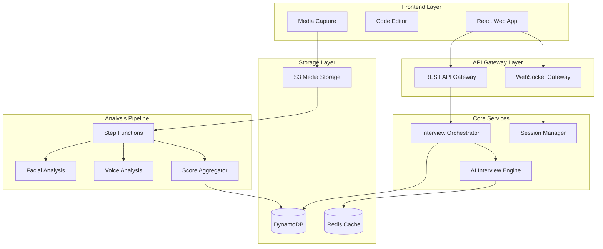

# Design Document: InterviewPrep AI

## Overview

InterviewPrep AI is a cloud-native, multi-modal interview practice platform that combines AI-driven conversation, real-time media processing, and comprehensive behavioral analysis. The system orchestrates complex workflows using AWS Step Functions to coordinate resume parsing, dynamic question generation, multi-modal data capture, and holistic performance evaluation.

The architecture follows a microservices pattern with clear separation between real-time interview orchestration and asynchronous analysis pipelines. This design enables cost-effective scaling while maintaining sub-5-second response times for AI interactions and comprehensive post-interview analysis.

## Architecture

### High-Level Architecture



### Component Interaction Flow

The system operates in two distinct phases:

**Real-time Interview Phase:**
1. Frontend captures audio/video streams and uploads to S3
2. Interview Orchestrator manages conversation state and AI interactions
3. AI Interview Engine generates contextual questions and evaluates responses
4. Session Manager maintains resilient state across network interruptions

**Asynchronous Analysis Phase:**
1. Step Functions orchestrates parallel analysis pipelines
2. Facial Analysis Pipeline processes video frames for emotion detection
3. Voice Analysis Pipeline extracts acoustic features and confidence metrics
4. Score Aggregator combines all analysis results into holistic feedback

## Components and Interfaces

### Frontend Components

**React Web Application**
- **Interview Interface**: Real-time conversation UI with video preview
- **Code Editor**: Integrated coding environment with syntax highlighting
- **Media Capture Manager**: Handles WebRTC streams and local buffering
- **Session Recovery**: Automatic reconnection and state restoration

**Key Interfaces:**
```typescript
interface InterviewSession {
  sessionId: string;
  candidateId: string;
  resumeContext: ResumeContext;
  currentQuestion: Question;
  responses: Response[];
  mediaUrls: MediaUrls;
  status: SessionStatus;
}

interface MediaCapture {
  startRecording(): Promise<void>;
  stopRecording(): Promise<MediaUrls>;
  uploadChunk(chunk: Blob): Promise<void>;
  getBufferedData(): Blob[];
}
```

### Backend Core Services

**Interview Orchestrator**
- Manages interview flow and state transitions
- Coordinates between AI engine and session persistence
- Handles resume context injection and question sequencing
- Implements circuit breaker patterns for AI service failures

**AI Interview Engine**
- Integrates with AWS Bedrock or external LLM APIs
- Generates resume-aware questions with company-specific styling
- Evaluates technical responses for correctness and clarity
- Maintains conversation context and generates dynamic follow-ups

**Session Manager**
- Provides resilient session state management
- Implements checkpoint-based recovery mechanisms
- Handles concurrent session scaling and resource allocation
- Manages session timeouts and graceful termination

**Key Interfaces:**
```typescript
interface AIInterviewEngine {
  generateQuestion(context: InterviewContext): Promise<Question>;
  evaluateResponse(response: Response): Promise<Evaluation>;
  generateFollowUp(evaluation: Evaluation): Promise<Question>;
}

interface SessionManager {
  createSession(candidateId: string): Promise<SessionId>;
  saveCheckpoint(sessionId: string, state: SessionState): Promise<void>;
  recoverSession(sessionId: string): Promise<SessionState>;
}
```

### Analysis Pipeline Components

**Step Functions Orchestrator**
Based on AWS best practices for multi-stage AI workflows, the orchestrator coordinates parallel analysis tasks with proper error handling and retry logic. The workflow implements the following pattern:

```json
{
  "Comment": "Multi-modal interview analysis pipeline",
  "StartAt": "ParallelAnalysis",
  "States": {
    "ParallelAnalysis": {
      "Type": "Parallel",
      "Branches": [
        {
          "StartAt": "FacialAnalysis",
          "States": {
            "FacialAnalysis": {
              "Type": "Task",
              "Resource": "arn:aws:batch:region:account:job-queue/facial-analysis"
            }
          }
        },
        {
          "StartAt": "VoiceAnalysis", 
          "States": {
            "VoiceAnalysis": {
              "Type": "Task",
              "Resource": "arn:aws:batch:region:account:job-queue/voice-analysis"
            }
          }
        }
      ],
      "Next": "AggregateResults"
    }
  }
}
```

**Facial Analysis Pipeline**
Leverages MediaPipe's BlazeFace model for real-time face detection and landmark extraction. The pipeline processes video at 1 FPS to balance accuracy with cost efficiency:

- **Frame Sampling**: Extracts frames at 1 FPS using FFmpeg
- **Face Detection**: MediaPipe Face Landmarker identifies facial landmarks
- **Emotion Classification**: Custom lightweight classifier trained on facial action units
- **Confidence Timeline**: Generates time-series data for stress and engagement levels

**Voice Analysis Pipeline**
Utilizes openSMILE for comprehensive acoustic feature extraction with real-time processing capabilities:

- **Voice Activity Detection**: Removes silence periods to reduce processing costs
- **Feature Extraction**: openSMILE generates 6,373 acoustic features per audio segment
- **Emotion Classification**: SVM classifier trained on prosodic and spectral features
- **Confidence Metrics**: Analyzes speech rate, hesitation patterns, and vocal stress indicators

**Key Interfaces:**
```typescript
interface FacialAnalysisResult {
  emotionTimeline: EmotionPoint[];
  confidenceScore: number;
  stressIndicators: StressEvent[];
  engagementLevel: number;
}

interface VoiceAnalysisResult {
  voiceConfidence: ConfidencePoint[];
  emotionalState: EmotionClassification[];
  speechMetrics: SpeechMetrics;
  stressMarkers: StressMarker[];
}
```

## Data Models

### Core Domain Models

**Interview Session Model**
```typescript
interface InterviewSession {
  sessionId: string;
  candidateId: string;
  createdAt: Date;
  updatedAt: Date;
  status: 'active' | 'paused' | 'completed' | 'failed';
  resumeContext: ResumeContext;
  questions: Question[];
  responses: Response[];
  mediaUrls: MediaUrls;
  checkpoints: SessionCheckpoint[];
}

interface ResumeContext {
  skills: Skill[];
  experience: Experience[];
  projects: Project[];
  education: Education[];
  parsedAt: Date;
}
```

**Analysis Results Model**
```typescript
interface AnalysisResult {
  sessionId: string;
  technicalScore: TechnicalEvaluation;
  communicationScore: CommunicationEvaluation;
  behavioralScore: BehavioralEvaluation;
  overallScore: number;
  feedback: FeedbackReport;
  createdAt: Date;
}

interface TechnicalEvaluation {
  correctness: number;
  codeQuality: number;
  problemSolving: number;
  explanationClarity: number;
  detailedFeedback: string[];
}

interface BehavioralEvaluation {
  confidenceLevel: number;
  stressManagement: number;
  engagement: number;
  emotionalStability: number;
  confidenceMismatchEvents: ConfidenceMismatch[];
}
```

### Media Processing Models

**Media Timeline Model**
```typescript
interface MediaTimeline {
  sessionId: string;
  audioUrl: string;
  videoUrl: string;
  transcriptSegments: TranscriptSegment[];
  facialEmotions: EmotionPoint[];
  voiceMetrics: VoicePoint[];
  synchronizationOffset: number;
}

interface EmotionPoint {
  timestamp: number;
  emotion: 'confident' | 'nervous' | 'engaged' | 'stressed';
  intensity: number;
  facialLandmarks?: FacialLandmark[];
}
```

## Correctness Properties

*A property is a characteristic or behavior that should hold true across all valid executions of a system—essentially, a formal statement about what the system should do. Properties serve as the bridge between human-readable specifications and machine-verifiable correctness guarantees.*

### Property Reflection

After analyzing all acceptance criteria, several properties can be consolidated to eliminate redundancy:

- Resume-question relationship properties (1.1, 2.2, 2.3) combine into comprehensive resume-aware generation
- Media capture properties (3.1, 3.3, 3.5) consolidate into complete capture workflow validation
- Analysis completeness properties (4.2, 5.3, 7.1, 7.2) merge into comprehensive evaluation coverage
- Timeline properties (4.3, 5.5) combine into synchronized multi-modal timeline generation
- Feedback properties (9.1, 9.4) consolidate into comprehensive feedback specificity
- Resilience properties (4.4, 11.1, 11.2) merge into fault tolerance validation

### Core Correctness Properties

**Property 1: Resume-Aware Question Generation**
*For any* uploaded resume and interview session, generated questions should reference specific resume elements (skills, projects, or experience) in at least 60% of technical questions, and follow-up questions should probe deeper when unfamiliar technologies are mentioned.
**Validates: Requirements 1.1, 2.2, 2.3**

**Property 2: AI Response Timing Consistency**
*For any* candidate response during an interview, the AI interviewer should generate contextually appropriate follow-up questions within 5 seconds while maintaining conversation coherence by referencing previous answers.
**Validates: Requirements 1.2, 2.5**

**Property 3: Complete Media Capture Workflow**
*For any* interview session, the system should simultaneously capture audio, video, and coding interactions with proper timing information, compress the data for cost efficiency, and upload all captured media to secure storage within 2 minutes of session completion.
**Validates: Requirements 3.1, 3.3, 3.5**

**Property 4: Multi-Modal Analysis Completeness**
*For any* completed interview, the analysis pipeline should generate comprehensive evaluations covering all specified dimensions: technical correctness/efficiency/quality, communication clarity/accuracy/completeness, and behavioral stress/confidence/engagement levels.
**Validates: Requirements 4.2, 5.3, 7.1, 7.2**

**Property 5: Synchronized Timeline Generation**
*For any* interview with audio and video data, the system should generate temporally synchronized timelines for facial emotions, voice confidence, and transcript segments, with proper interpolation for missing data points.
**Validates: Requirements 4.3, 5.5**

**Property 6: Frame Processing Consistency**
*For any* video input, the facial analysis pipeline should sample frames at exactly 1 FPS regardless of input frame rate, focus on the primary face when multiple faces are detected, and maintain consistent emotion classification across all processed frames.
**Validates: Requirements 4.1, 4.5**

**Property 7: Voice Processing Pipeline**
*For any* audio input, the voice analysis pipeline should apply voice activity detection to remove silence, extract openSMILE acoustic features, and generate confidence metrics including hesitation patterns, speech rate variations, and vocal stress indicators.
**Validates: Requirements 5.1, 5.2**

**Property 8: Real-Time Transcription Performance**
*For any* spoken input during an interview, the Web Speech API should provide transcription results within 2 seconds, handle multiple accents without configuration, and flag low-confidence words for user feedback.
**Validates: Requirements 6.1, 6.2, 6.4**

**Property 9: Holistic Score Aggregation**
*For any* completed analysis, the aggregation service should combine technical scores, voice metrics, and facial emotion data into a weighted overall assessment, detect confidence mismatches between modalities, and correlate stress spikes with specific interview content.
**Validates: Requirements 8.1, 8.2, 8.3**

**Property 10: Comprehensive Feedback Generation**
*For any* interview assessment, the feedback system should provide specific timestamps and examples for all identified strengths and weaknesses, explain how each metric contributed to the overall score, and generate actionable improvement strategies with concrete practice recommendations.
**Validates: Requirements 9.1, 9.4, 9.2, 9.3**

**Property 11: System Resilience and Recovery**
*For any* network interruption, browser crash, or system failure during an interview, the system should preserve interview state, enable seamless recovery from the last checkpoint, and maintain data integrity without loss of captured media or conversation context.
**Validates: Requirements 4.4, 11.1, 11.2**

**Property 12: Performance Under Load**
*For any* number of concurrent interviews up to system capacity, AI interaction response times should remain under 5 seconds, auto-scaling should provision resources within 3 minutes of demand spikes, and spot instance terminations should not cause data loss.
**Validates: Requirements 10.1, 10.2, 10.3**

**Property 13: Data Security and Privacy**
*For any* user data in the system, all transmissions should use TLS 1.3 encryption, all stored media should use AES-256 encryption, user deletion requests should complete within 24 hours, and analysis pipelines should not log personally identifiable information.
**Validates: Requirements 12.1, 12.2, 12.4, 12.5**

**Property 14: Session State Persistence**
*For any* active interview session, the system should save progress checkpoints every 30 seconds, provide timeout warnings with extension options, and maintain conversation context across pause/resume cycles.
**Validates: Requirements 11.4, 11.5, 11.3**

**Property 15: Cost Optimization Effectiveness**
*For any* system usage pattern, the cost optimization system should implement tiered analysis based on service level, automatically archive old data according to lifecycle policies, and maintain processing costs within defined budget constraints.
**Validates: Requirements 10.4, 10.5**

## Error Handling

### Failure Modes and Recovery Strategies

**AI Service Failures**
- Circuit breaker pattern with exponential backoff for LLM API calls
- Fallback to cached question templates when AI generation fails
- Graceful degradation to basic evaluation when advanced AI analysis is unavailable

**Media Processing Failures**
- Retry logic with exponential backoff for failed analysis jobs
- Partial result handling when some analysis pipelines fail
- Default scoring when emotion/voice analysis is unavailable

**Network and Infrastructure Failures**
- Local buffering of media data during network outages
- Session state checkpointing every 30 seconds
- Automatic session recovery with context preservation
- Multi-AZ deployment for high availability

**Data Consistency and Integrity**
- Transactional updates for session state changes
- Media upload verification with checksums
- Analysis result validation before aggregation
- Audit logging for all critical operations

### Error Monitoring and Alerting

**Real-time Monitoring**
- CloudWatch metrics for API response times and error rates
- Custom metrics for AI service latency and accuracy
- Media processing pipeline success rates
- User session completion rates

**Alerting Thresholds**
- AI response time > 10 seconds (warning), > 15 seconds (critical)
- Media upload failure rate > 5% (warning), > 10% (critical)
- Analysis pipeline failure rate > 2% (warning), > 5% (critical)
- Session recovery failure rate > 1% (critical)

## Testing Strategy

### Dual Testing Approach

The testing strategy employs both unit testing and property-based testing as complementary approaches to ensure comprehensive coverage:

**Unit Testing Focus:**
- Specific examples of resume parsing with known skill sets
- Edge cases in media processing (corrupted files, unusual formats)
- Error conditions in AI service integration
- Integration points between microservices
- Authentication and authorization workflows

**Property-Based Testing Focus:**
- Universal properties that hold across all inputs
- Comprehensive input coverage through randomization
- Validation of correctness properties defined in this design
- Performance characteristics under varying load conditions

### Property-Based Testing Configuration

**Testing Framework:** 
- **Python**: Hypothesis for backend services and analysis pipelines
- **TypeScript**: fast-check for frontend components and API integration
- **Infrastructure**: AWS CodeBuild for automated test execution

**Test Configuration:**
- Minimum 100 iterations per property test to ensure statistical significance
- Each property test references its corresponding design document property
- Tag format: **Feature: interview-prep-ai, Property {number}: {property_text}**

**Example Property Test Structure:**
```python
@given(resume=resume_strategy(), interview_type=interview_type_strategy())
def test_resume_aware_question_generation(resume, interview_type):
    """Feature: interview-prep-ai, Property 1: Resume-Aware Question Generation"""
    questions = ai_interviewer.generate_questions(resume, interview_type)
    resume_referencing_questions = [q for q in questions if references_resume(q, resume)]
    
    assert len(resume_referencing_questions) / len(questions) >= 0.6
    assert all(is_contextually_appropriate(q, resume) for q in resume_referencing_questions)
```

### Integration Testing Strategy

**End-to-End Workflow Testing:**
- Complete interview simulation with synthetic data
- Multi-modal analysis pipeline validation
- Report generation and feedback quality assessment
- Performance testing under realistic load conditions

**Service Integration Testing:**
- API contract validation between microservices
- Event-driven communication testing with AWS Step Functions
- Database consistency across service boundaries
- Media processing pipeline integration

### Performance and Load Testing

**Load Testing Scenarios:**
- Concurrent interview sessions (10, 50, 100, 500 users)
- Media upload stress testing with large files
- Analysis pipeline throughput under peak load
- Database performance with high query volumes

**Performance Benchmarks:**
- AI response time: < 5 seconds (95th percentile)
- Media upload completion: < 2 minutes for 30-minute interviews
- Analysis pipeline completion: < 10 minutes for full multi-modal analysis
- Report generation: < 30 seconds for comprehensive feedback